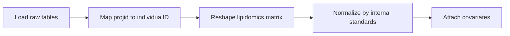

# Data Processing (Step 01)

Step 01 transforms raw lipidomics and metadata tables into a clean, analysis-ready dataset. This step handles identifier mapping, matrix reshaping, internal-standard normalization, and covariate attachment.

## What This Step Does

The data processing pipeline performs five operations in sequence:



1. **Load raw input tables.** Reads the SERRF-normalized lipidomics matrix, longitudinal metadata, clinical metadata, and specimen-to-individual mapping file from `data/raw/`.

2. **Map `projid` to `individualID`.** ROSMAP uses `projid` as the primary participant identifier in longitudinal data, but lipidomics specimens are linked by `individualID`. The clinical metadata table provides the crosswalk between these identifiers. The function `add_individual_ids_to_longitudinal()` performs this merge.

3. **Reshape the lipidomics matrix.** The raw lipidomics file is organized with lipids as rows and samples as columns. The function `reshape_lipidomics_matrix()` transposes this into a sample-by-lipid format where each row is a participant and each column is a lipid feature. Sample labels are parsed to extract `individualID` via `add_individual_id_column()`.

4. **Normalize by internal standards.** Lipid intensities are normalized against internal standards to correct for technical variation. The function `normalize_by_internal_standards()` handles positive-mode and negative-mode lipids separately, applying the appropriate internal standard for each mode.

5. **Attach covariates.** The function `attach_covariates()` merges the lipidomics data with analysis covariates from the longitudinal and clinical metadata. These include social isolation score (`SI_avg`), NIA-Reagan score (`niareagansc`), sex (`msex`), age at death (`age_death`), education (`educ`), postmortem interval (`pmi`), APOE genotype (`apoe_genotype`), and medication variables.

## How to Run

**Script:**

```bash
python scripts/01_data_processing.py
```

**Notebook:**

Open and run `notebooks/01_data_processing.ipynb` from the repository root.

!!! note "Start Jupyter from the repository root"
    Notebooks rely on imports such as `from config import ...` that resolve relative to the working directory. Always launch Jupyter from the `ROSMAP-SI-Lipidomics/` directory.

## Input Files

| File | Location | Description |
|------|----------|-------------|
| SERRF-normalized lipidomics | `data/raw/lipidomics_data/ROSMAP_Brain_SERRF_normalization_internal.csv` | Lipid-by-sample intensity matrix with `label`, `Mode`, and `lipid class` columns |
| Longitudinal metadata | `data/raw/metadata/dataset_652_basic_03-23-2022.csv` | Phenotype data with `projid`, `social_isolation_avg`, `niareagansc`, demographics |
| Clinical metadata | `data/raw/metadata/ROSMAP_clinical.csv` | Maps `projid` to `individualID` |
| Specimen-to-individual map | `data/raw/metadata/Lip_Ind_Map.csv` | Maps lipidomics `specimenID` to `individualID` |

## Output Files

| File | Location | Description |
|------|----------|-------------|
| Normalized lipidomics | `data/processed/Normalized_Formatted_Lipidomics.csv` | Sample-by-lipid matrix after internal-standard normalization, before covariate merge |
| Final formatted lipidomics | `data/processed/Final_Formatted_Lipidomics.csv` | Complete analysis-ready dataset with lipid features and all covariates |

The `Final_Formatted_Lipidomics.csv` file is the primary input for all subsequent pipeline steps (02 through 05).

## Key Fields in the Output

The `Final_Formatted_Lipidomics.csv` contains:

- **Lipid feature columns:** one column per lipid species, with normalized intensity values. These can be identified programmatically using the `get_lipid_columns()` utility function from `src/data_utils.py`.
- **`SI_avg`:** continuous social isolation score (the primary predictor).
- **`msex`:** binary sex variable (1 = male, 0 = female).
- **`age_death`:** age at death in years.
- **`educ`:** years of education.
- **`pmi`:** postmortem interval in hours.
- **`apoe_genotype`:** APOE allele status.
- **`niareagansc`:** NIA-Reagan neuropathological diagnosis score.
- **`individualID`:** unique participant identifier.

## Key Decisions and Parameters

- **Internal-standard normalization** is applied per ionization mode (positive and negative). Each lipid's intensity is divided by the corresponding internal standard for its mode. This corrects for systematic differences in ionization efficiency across samples.

- **The `prepare_analysis_dataset()` function** in `src/data_utils.py` provides an end-to-end convenience wrapper that chains all five operations. Both the script and notebook call this function.

- **Rows with missing covariates** are retained at this stage. Downstream steps handle missing data in their model-fitting functions (typically via listwise deletion in `statsmodels`).
