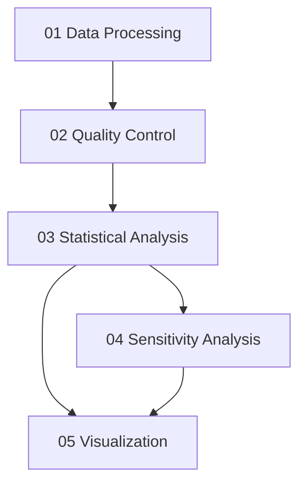

# Lipidomics

This pipeline investigates the relationship between social isolation and brain lipidomics in the Religious Orders Study and Memory and Aging Project (ROSMAP) cohort. The analysis addresses two core questions: whether social isolation scores are associated with lipid abundance across the brain lipidome, and whether those associations differ between males and females.

The pipeline processes raw SERRF-normalized lipidomics data alongside ROSMAP clinical and longitudinal metadata, applies quality control procedures, fits per-lipid and category-level regression models, tests for sex-differential effects via ANCOVA interaction terms, runs sensitivity analyses excluding confirmed AD pathology, and generates publication-ready figures.

## Analysis Flow

The pipeline proceeds through five sequential steps. Steps 04 and 05 both depend on Step 03, but are independent of each other.



| Step | Description | Page |
|------|-------------|------|
| 01 | Data processing: ID mapping, reshaping, normalization, covariate attachment | [Data Processing](data-processing.md) |
| 02 | Quality control: LOF outlier detection, Shapiro-Wilk normality, FDR correction | [Quality Control](quality-control.md) |
| 03 | Statistical analysis: per-lipid OLS, category models, ANCOVA sex interaction | [Statistical Analysis](statistical-analysis.md) |
| 04 | Sensitivity analysis: no-AD filter, z-score scaling | [Sensitivity Analysis](sensitivity-analysis.md) |
| 05 | Visualization: volcano plots, bar plots, scatter/regression plots | [Visualization](visualization.md) |

## Run Modes

The pipeline offers two equivalent execution paths. Both produce the same outputs.

**Scripts (recommended for reproducibility).** Run the five Python scripts in sequence from the repository root. This mode is best for batch execution and automated pipelines.

```bash
python scripts/01_data_processing.py
python scripts/02_quality_control.py
python scripts/03_statistical_analysis.py
python scripts/04_sensitivity_no_ad.py
python scripts/05_visualization.py
```

**Jupyter notebooks (recommended for exploration).** Run the five notebooks in order. This mode provides inline commentary, intermediate outputs, and is well suited for walkthrough sessions and figure review.

1. `notebooks/01_data_processing.ipynb`
2. `notebooks/02_quality_control.ipynb`
3. `notebooks/03_statistical_analysis.ipynb`
4. `notebooks/04_sensitivity_no_ad.ipynb`
5. `notebooks/05_visualization.ipynb`

## Guide Contents

- [Scientific Background](background.md): research questions, ANCOVA rationale, covariates
- [Environment Setup](setup.md): cloning, dependencies, data acquisition, configuration
- [Data Processing](data-processing.md): Step 01 details
- [Quality Control](quality-control.md): Step 02 details
- [Statistical Analysis](statistical-analysis.md): Step 03 details
- [Sensitivity Analysis](sensitivity-analysis.md): Step 04 details
- [Visualization](visualization.md): Step 05 details
- [Interpreting Results](interpreting-results.md): output columns, interaction terms, file inventory
