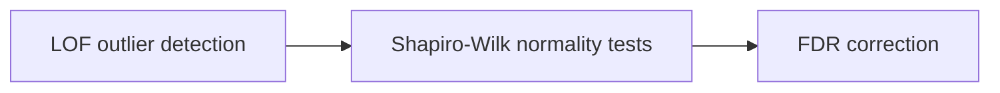

# Quality Control (Step 02)

Step 02 evaluates the processed dataset for sample-level outliers and assesses the distributional properties of individual lipid features. These diagnostics inform whether the data are suitable for the parametric models used in Step 03.

## What This Step Does

The quality control pipeline performs three operations:



### Local Outlier Factor (LOF) Outlier Detection

The Local Outlier Factor algorithm identifies samples whose local density deviates substantially from that of their neighbors in the lipid feature space. LOF is a density-based method, meaning it does not assume a particular distribution shape and can detect outliers that would be missed by simpler distance-based approaches.

The function `run_lof_outlier_detection()` from `src/stats_utils.py` computes an LOF score for each sample. Samples with scores well below -1 are flagged as potential outliers. The output includes per-sample LOF scores and a distribution plot (`qc_lof_score_distribution.png`) for visual inspection.

LOF-flagged samples are reported for review but are not automatically removed. The decision to exclude outliers is left to the analyst.

### Shapiro-Wilk Normality Testing

The Shapiro-Wilk test evaluates whether each lipid feature follows a normal distribution. This is relevant because the downstream OLS regression models assume normally distributed residuals. The function `run_shapiro_normality_tests()` runs a Shapiro-Wilk test on every lipid column and records the test statistic and p-value.

Lipids with low p-values (rejecting the null hypothesis of normality) may warrant transformation or non-parametric alternatives in downstream analysis. A histogram of Shapiro-Wilk p-values (`qc_shapiro_pvalue_distribution.png`) summarizes the overall normality landscape.

### FDR Correction

Because hundreds of lipids are tested simultaneously for normality, the function `add_fdr_column()` applies Benjamini-Hochberg false discovery rate correction to the Shapiro-Wilk p-values. This provides adjusted p-values that account for multiple testing, giving a more reliable assessment of which lipids genuinely deviate from normality.

## How to Run

**Script:**

```bash
python scripts/02_quality_control.py
```

**Notebook:**

Open and run `notebooks/02_quality_control.ipynb` from the repository root.

## Input Files

| File | Location | Description |
|------|----------|-------------|
| Final formatted lipidomics | `data/processed/Final_Formatted_Lipidomics.csv` | Analysis-ready dataset from Step 01 |

## Output Files

### Tables

| File | Location | Description |
|------|----------|-------------|
| LOF scores | `results/tables/qc_lof_scores.csv` | Per-sample LOF scores with outlier flags |
| Shapiro-Wilk results | `results/tables/qc_shapiro_normality.csv` | Per-lipid normality test statistics, raw p-values, and FDR-adjusted p-values |

### Figures

| File | Location | Description |
|------|----------|-------------|
| LOF score distribution | `results/figures/qc_lof_score_distribution.png` | Histogram of sample-level LOF scores |
| Shapiro-Wilk p-value distribution | `results/figures/qc_shapiro_pvalue_distribution.png` | Histogram of per-lipid normality test p-values |

## Interpreting the QC Outputs

**LOF scores.** An LOF score near -1 indicates a sample with local density comparable to its neighbors (not an outlier). Scores substantially below -1 indicate samples in sparser regions of the feature space, suggesting they may be compositionally atypical. Review flagged samples to determine whether they reflect genuine biological variation or technical artifacts.

**Shapiro-Wilk p-values.** A uniform distribution of p-values across the [0, 1] interval suggests that most lipids are approximately normally distributed. An excess of low p-values indicates that many lipids deviate from normality. In practice, OLS regression is relatively robust to moderate departures from normality, particularly with larger sample sizes. However, strongly non-normal lipids may benefit from log-transformation or rank-based approaches.

!!! tip "QC results do not gate the pipeline"
    Step 02 is diagnostic, not filtering. The pipeline does not automatically exclude outlier samples or transform non-normal lipids. Use the QC outputs to guide manual decisions about sample exclusion or data transformation before proceeding to Step 03.
