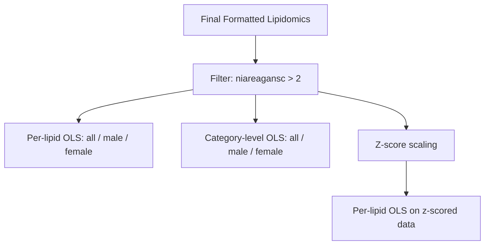

# Sensitivity Analysis (Step 04)

Step 04 tests the robustness of the primary findings by repeating the analysis under modified conditions: excluding participants with confirmed AD pathology and applying z-score scaling to lipid features.

## Purpose

The primary analysis in Step 03 includes all available samples regardless of AD diagnosis. This raises the question of whether observed SI-lipid associations are driven by, or confounded by, AD pathology rather than reflecting a direct relationship between social isolation and lipid composition. The sensitivity analysis addresses this concern in two ways:

1. **No-AD filter.** By excluding samples with NIA-Reagan scores indicating confirmed AD pathology, the analysis tests whether SI-lipid associations persist in a population free of substantial AD neuropathology.

2. **Z-score scaling.** By standardizing lipid features to zero mean and unit variance before fitting models, the analysis produces standardized coefficients that are directly comparable across lipids with different concentration ranges. This tests whether the magnitude of associations is consistent under a different scaling scheme.

If findings from Step 03 replicate in the no-AD subset and under z-score scaling, confidence in their robustness increases.

## What This Step Does



### No-AD Filter

The function `filter_no_ad()` from `src/stats_utils.py` retains only samples where `niareagansc > 2`. In the NIA-Reagan scoring system, lower values indicate higher likelihood of AD pathology:

| Score | Interpretation |
|-------|---------------|
| 1 | High likelihood of AD |
| 2 | Intermediate likelihood of AD |
| 3 | Low likelihood of AD |
| 4 | No AD |

Filtering to `niareagansc > 2` excludes individuals with high or intermediate likelihood of AD, retaining those with low likelihood or no AD pathology. The filtered dataset is saved as `sensitivity_noad_dataset.csv`.

### Regression Models on No-AD Subset

After filtering, the same per-lipid and category-level OLS regression models from Step 03 are rerun on the reduced cohort. As in Step 03, models are fit separately for all samples, males only, and females only. Covariates remain the same.

When the `--include-pmi` flag is used, postmortem interval is added to the model:

```bash
python scripts/04_sensitivity_no_ad.py --include-pmi
```

### Z-Score Scaling Sensitivity Pass

The function `zscore_columns()` standardizes each lipid column to zero mean and unit variance within the no-AD subset. The per-lipid OLS models are then rerun on these z-scored features. The resulting coefficients represent the change in lipid level (in standard deviation units) per unit increase in `SI_avg`, making effect sizes directly comparable across lipids regardless of their original scale.

## How to Run

**Script:**

```bash
python scripts/04_sensitivity_no_ad.py
```

**Notebook:**

Open and run `notebooks/04_sensitivity_no_ad.ipynb` from the repository root.

## Input Files

| File | Location | Description |
|------|----------|-------------|
| Final formatted lipidomics | `data/processed/Final_Formatted_Lipidomics.csv` | Analysis-ready dataset from Step 01 |

## Output Files

### Filtered Dataset

| File | Location | Description |
|------|----------|-------------|
| No-AD dataset | `results/tables/sensitivity_noad_dataset.csv` | Subset of the processed data with `niareagansc > 2` |

### Per-Lipid Results (No-AD Subset)

| File Pattern | Location | Description |
|--------------|----------|-------------|
| `sensitivity_noad_lipid_*.csv` | `results/tables/` | OLS results for each lipid in the no-AD cohort (all, male, female splits) |

### Category-Level Results (No-AD Subset)

| File Pattern | Location | Description |
|--------------|----------|-------------|
| `sensitivity_noad_category_*.csv` | `results/tables/` | OLS results for category means in the no-AD cohort (all, male, female splits) |

### Z-Score Scaled Results

| File Pattern | Location | Description |
|--------------|----------|-------------|
| `sensitivity_noad_lipid_zscore_*.csv` | `results/tables/` | OLS results using z-scored lipid features in the no-AD cohort |

## Interpreting Sensitivity Results

When comparing Step 04 results to Step 03 results, focus on the following:

- **Direction of effect.** Do the signs of `coef_SI_avg` agree between the primary and sensitivity analyses? Consistent directionality supports robustness.

- **Statistical significance.** Some loss of significance is expected due to the smaller sample size after filtering. Lipids that remain significant (or near-significant) in the no-AD subset are more likely to reflect genuine SI-lipid associations.

- **Z-score coefficients.** These allow direct comparison of effect magnitudes across lipids. A lipid with a z-scored coefficient of 0.3 shows a 0.3 standard deviation change in abundance per unit increase in SI, regardless of the original measurement scale.

!!! note "Reduced sample size"
    Excluding confirmed AD cases reduces the available sample size. Statistical power decreases accordingly, so non-significant results in the sensitivity analysis do not necessarily invalidate significant findings from the primary analysis. The key question is whether the direction and approximate magnitude of effects are preserved.
