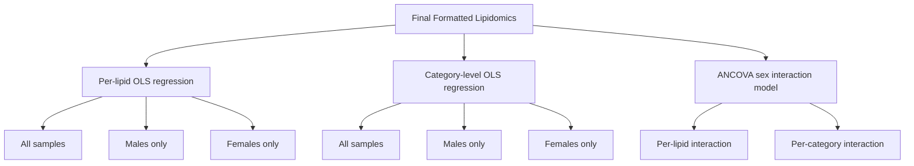

# Statistical Analysis (Step 03)

Step 03 is the core analytical step. It fits per-lipid OLS regression models, category-level models, and ANCOVA sex interaction models to test associations between social isolation and brain lipid levels.

## What This Step Does

The statistical analysis comprises three modeling strategies:



### Per-Lipid OLS Regression

For each individual lipid, an ordinary least squares (OLS) model is fit with the lipid abundance as the dependent variable and `SI_avg` as the primary predictor. The model adjusts for covariates:

```
lipid ~ SI_avg + age_death + educ + apoe_genotype
```

When the `--include-pmi` flag is used, postmortem interval is added:

```
lipid ~ SI_avg + age_death + educ + apoe_genotype + pmi
```

The function `run_per_lipid_regression()` from `src/stats_utils.py` fits this model iteratively across all lipid columns and collects coefficients, standard errors, p-values, and R-squared values.

This procedure is run three times using cohort splits produced by `split_by_sex()`:

1. **All samples** (pooled male and female)
2. **Males only** (`msex == 1`)
3. **Females only** (`msex == 0`)

### Category-Level Models

Lipid species belong to broader categories (e.g., phosphatidylcholines, sphingomyelins, ceramides). The function `compute_category_means()` calculates the mean abundance across all lipids within each category for every sample, producing `catmean_*` features. The same OLS model is then fit to each category-mean feature, again in all three cohort splits.

Category-level models provide a higher-level view of SI-lipid associations, trading granularity for increased statistical power through within-category averaging.

### ANCOVA Sex Interaction Model

The ANCOVA model directly tests whether the SI-lipid association differs by sex. The interaction model takes the form:

```
lipid ~ SI_avg * msex + age_death + niareagansc
```

The `SI_avg * msex` term expands to:

- `SI_avg`: main effect of social isolation
- `msex`: main effect of sex
- `SI_avg:msex`: the interaction term, testing whether the SI slope differs between sexes

The function `run_ancova_sex_interaction()` fits this model for every lipid and every category-mean feature. The interaction coefficient (`coef_interaction`) and its significance (`p_interaction`, `fdr_p_interaction`) are the primary outputs of interest.

!!! warning "The ANCOVA model uses a different covariate set"
    The ANCOVA interaction model adjusts for `age_death` and `niareagansc`, not the full covariate set used in the stratified OLS models. This is by design; the model includes `msex` as an explicit term, and the covariates are selected to avoid collinearity with the interaction structure.

## How to Run

**Script:**

```bash
python scripts/03_statistical_analysis.py
```

To include postmortem interval as an additional covariate in the OLS models:

```bash
python scripts/03_statistical_analysis.py --include-pmi
```

**Notebook:**

Open and run `notebooks/03_statistical_analysis.ipynb` from the repository root.

## Input Files

| File | Location | Description |
|------|----------|-------------|
| Final formatted lipidomics | `data/processed/Final_Formatted_Lipidomics.csv` | Analysis-ready dataset from Step 01 |

## Output Files

### Per-Lipid Results

| File | Location | Description |
|------|----------|-------------|
| All samples | `results/tables/stats_lipid_all.csv` | OLS results for each lipid, pooled cohort |
| Males only | `results/tables/stats_lipid_male.csv` | OLS results for each lipid, males only |
| Females only | `results/tables/stats_lipid_female.csv` | OLS results for each lipid, females only |

### Category-Level Results

| File | Location | Description |
|------|----------|-------------|
| All samples | `results/tables/stats_category_all.csv` | OLS results for category means, pooled cohort |
| Males only | `results/tables/stats_category_male.csv` | OLS results for category means, males only |
| Females only | `results/tables/stats_category_female.csv` | OLS results for category means, females only |

### ANCOVA Interaction Results

| File | Location | Description |
|------|----------|-------------|
| Per-lipid interaction | `results/tables/ancova_sex_lipid.csv` | ANCOVA interaction results for each lipid |
| Per-category interaction | `results/tables/ancova_sex_category.csv` | ANCOVA interaction results for each category mean |

## Output Column Definitions

Each results CSV contains the following columns (exact names may vary slightly by file):

| Column | Description |
|--------|-------------|
| `lipid` or `category` | Feature name |
| `coef_SI_avg` | Regression coefficient for social isolation |
| `se_SI_avg` | Standard error of the SI coefficient |
| `p_SI_avg` | Nominal p-value for the SI coefficient |
| `fdr_p_SI_avg` | FDR-adjusted p-value for the SI coefficient |
| `r_squared` | Model R-squared |
| `n` | Number of observations used in the model |

The ANCOVA files additionally contain:

| Column | Description |
|--------|-------------|
| `coef_interaction` | Coefficient of the `SI_avg:msex` interaction term |
| `p_interaction` | Nominal p-value for the interaction |
| `fdr_p_interaction` | FDR-adjusted p-value for the interaction |

## Key Decisions

- **FDR correction** is applied across all lipids (or categories) within each results file using the Benjamini-Hochberg procedure.
- **Missing data handling** uses listwise deletion, which is the default behavior in `statsmodels`. Samples missing any covariate are excluded from that model.
- **No multiple-testing correction is applied across cohort splits** (all, male, female). Each split is treated as a separate analysis.
