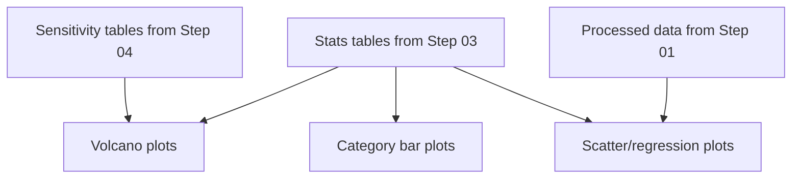

# Visualization (Step 05)

Step 05 generates publication-oriented summary figures from the statistical outputs produced in Steps 03 and 04. The figures provide visual overviews of SI-lipid associations across the lipidome, highlight sex-differential effects, and illustrate individual lipid-level relationships.

## What This Step Does



The visualization step reads results tables and processed data, then generates four types of figures.

### Volcano Plots

Volcano plots display the relationship between effect size (x-axis, regression coefficient for `SI_avg`) and statistical significance (y-axis, -log10 p-value) for each lipid. Points in the upper-left and upper-right corners represent lipids with both large effect sizes and high significance.

Four volcano plots are generated:

| Figure | Source Table | Description |
|--------|-------------|-------------|
| `volcano_all.png` | `stats_lipid_all.csv` | All samples, pooled cohort |
| `volcano_male.png` | `stats_lipid_male.csv` | Males only |
| `volcano_female.png` | `stats_lipid_female.csv` | Females only |
| `volcano_sex_interaction.png` | `ancova_sex_lipid.csv` | ANCOVA interaction term (`SI_avg:msex`) |

The interaction volcano plot is particularly informative: lipids appearing in the upper extremes of this plot show the strongest evidence for sex-differential SI associations. The x-axis displays `coef_interaction` and the y-axis displays `-log10(p_interaction)`.

### Category-Level Bar Plots

Category bar plots summarize the effect sizes of SI associations at the lipid-category level. Each bar represents a lipid category (e.g., phosphatidylcholines, ceramides), with the bar height corresponding to the regression coefficient from the category-mean model.

| Figure | Source Table | Description |
|--------|-------------|-------------|
| `category_effects_all.png` | `stats_category_all.csv` | Category-level effect sizes in the pooled cohort |

These plots provide a high-level summary of which lipid classes are most strongly associated with social isolation, complementing the granular per-lipid volcano plots.

### Scatter and Regression Plots

For the top-ranked lipids (by significance), individual scatter plots show the relationship between `SI_avg` (x-axis) and lipid abundance (y-axis), with a fitted regression line. These plots are useful for visually assessing linearity, identifying influential observations, and communicating individual lipid findings.

| Figure | Location | Description |
|--------|----------|-------------|
| Individual lipid plots | `results/figures/lipid_distribution_plots/*.png` | One scatter/regression plot per top lipid |

The number of top lipids plotted can be controlled with the `--top-n-lipids` flag:

```bash
python scripts/05_visualization.py --top-n-lipids 20
```

The default produces plots for the most significant lipids from the primary analysis.

## How to Run

**Script:**

```bash
python scripts/05_visualization.py
```

**Notebook:**

Open and run `notebooks/05_visualization.ipynb` from the repository root.

## Input Files

Step 05 reads from multiple sources:

| File | Location | Description |
|------|----------|-------------|
| Per-lipid OLS results | `results/tables/stats_lipid_*.csv` | From Step 03 |
| Category-level OLS results | `results/tables/stats_category_*.csv` | From Step 03 |
| ANCOVA interaction results | `results/tables/ancova_sex_lipid.csv` | From Step 03 |
| Sensitivity results | `results/tables/sensitivity_noad_*` | From Step 04 |
| Processed lipidomics data | `data/processed/Final_Formatted_Lipidomics.csv` | From Step 01 (for scatter plots) |

## Output Files

All figures are written to `results/figures/`.

| File | Description |
|------|-------------|
| `volcano_all.png` | Volcano plot, all samples |
| `volcano_male.png` | Volcano plot, males only |
| `volcano_female.png` | Volcano plot, females only |
| `volcano_sex_interaction.png` | Volcano plot, ANCOVA interaction term |
| `category_effects_all.png` | Category-level effect size bar plot |
| `lipid_distribution_plots/*.png` | Per-lipid scatter/regression plots for top-ranked lipids |

## Reading the Figures

**Volcano plots.** Each point is one lipid. The horizontal dashed line typically marks the -log10(0.05) significance threshold. Lipids above this line have nominal p < 0.05. Points farther from zero on the x-axis have larger effect sizes. Color coding or labeling may highlight lipids passing FDR correction.

**Category bar plots.** Bars are ordered by effect size. Positive coefficients indicate categories where higher SI is associated with greater lipid abundance; negative coefficients indicate the reverse. Error bars, when present, represent standard errors of the regression coefficients.

**Scatter plots.** Each point is one participant. The fitted line shows the estimated linear relationship between SI and lipid abundance after adjusting for covariates. These plots are most useful for confirming that the statistical relationship is not driven by a small number of extreme observations.
