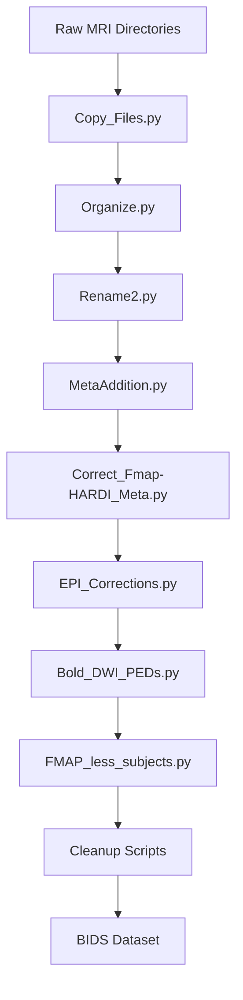

# BIDS Construction (Stage 01)

Stage 01 converts raw ROSMAP MRI data from its original directory structure into a BIDS-compliant dataset. This stage consists of a series of Python scripts that copy files, rename them according to BIDS conventions, inject required JSON sidecar metadata, correct fieldmap associations, and handle edge cases such as subjects missing fieldmap acquisitions.

## Overview

Unlike the subsequent stages, BIDS construction does not use SLURM job arrays. The scripts are run manually in sequence from the repository root. Some scripts contain hardcoded paths from the original processing environment and may require path edits before execution on a new system.



## Script Execution Order

Run the following scripts in order. Each script builds on the output of the previous one.

### Phase 1: File Organization

```bash
# Step 1: Copy raw files from source directories to working location
python 01_bids_construction/scripts/Copy_Files.py

# Step 2: Organize copied files into subject/session/modality folders
python 01_bids_construction/scripts/Organize.py

# Step 3: Rename files to BIDS naming convention
python 01_bids_construction/scripts/Rename2.py
```

`Copy_Files.py` reads source paths from the reference CSVs and copies NIfTI and associated files to a staging area. `Organize.py` creates the `sub-*/ses-*/` directory hierarchy. `Rename2.py` applies BIDS-compliant filenames (e.g., `sub-16064431_ses-02_acq-mpr_run-1_T1w.nii.gz`).

An alternative script, `Rename.py`, exists for earlier naming conventions. If `Rename.py` is used instead of `Rename2.py`, correction scripts (`DebugRename.py`, `Rename_Move_Met_New.py`) may be needed afterward.

### Phase 2: Metadata Injection

```bash
# Step 4: Add required metadata fields to JSON sidecars
python 01_bids_construction/scripts/MetaAddition.py

# Step 5: Correct fieldmap and HARDI-specific metadata
python 01_bids_construction/scripts/Correct_Fmap-HARDI_Meta.py

# Step 6: Apply EPI phase-encoding corrections
python 01_bids_construction/scripts/EPI_Corrections.py

# Step 7: Set phase-encoding directions for BOLD and DWI
python 01_bids_construction/scripts/Bold_DWI_PEDs.py
```

These scripts ensure that JSON sidecar files contain the fields required by downstream BIDS tools, including `IntendedFor` (linking fieldmaps to their target images), `PhaseEncodingDirection`, and readout timing parameters.

### Phase 3: Edge Cases and Cleanup

```bash
# Step 8: Identify subjects without fieldmap acquisitions
python 01_bids_construction/scripts/FMAP_less_subjects.py

# Step 9: Relocate fieldmap-less subjects if needed
python 01_bids_construction/scripts/Move_FMAP_less.py

# Step 10: Cleanup and corrections
python 01_bids_construction/scripts/move_T2.py
python 01_bids_construction/scripts/Rem_Extras.py
python 01_bids_construction/scripts/DebugRename.py
python 01_bids_construction/scripts/Rename_Move_Met_New.py
```

Not all cleanup scripts are needed for every run. `FMAP_less_subjects.py` generates a tracking CSV (`reference_csvs/fmap_less.csv`) listing subjects that lack fieldmap data, which downstream pipelines handle by skipping susceptibility distortion correction for those subjects.

## Reference CSV Inputs

The construction scripts depend on two reference CSV files:

| File | Purpose |
|------|---------|
| `01_bids_construction/reference_csvs/OG_Locations.csv` | Maps subject IDs to original raw data directories |
| `01_bids_construction/reference_csvs/Openmind_Directoris.csv` | Maps subject IDs to cluster-specific storage paths |

These CSVs must be updated if the raw data has been moved from its original location.

## Output Structure

The completed BIDS dataset follows this structure:

```
BIDS_DIR/
    dataset_description.json
    sub-<id>/
        ses-<session>/
            anat/
                sub-<id>_ses-<session>_acq-mpr_run-1_T1w.nii.gz
                sub-<id>_ses-<session>_acq-mpr_run-1_T1w.json
            dwi/
                sub-<id>_ses-<session>_acq-45dir_dir-AP_run-1_dwi.nii.gz
                sub-<id>_ses-<session>_acq-45dir_dir-AP_run-1_dwi.bval
                sub-<id>_ses-<session>_acq-45dir_dir-AP_run-1_dwi.bvec
                sub-<id>_ses-<session>_acq-45dir_dir-AP_run-1_dwi.json
            func/
                sub-<id>_ses-<session>_task-rest_acq-ep2d_dir-AP_run-1_bold.nii.gz
                sub-<id>_ses-<session>_task-rest_acq-ep2d_dir-AP_run-1_bold.json
            fmap/
                sub-<id>_ses-<session>_acq-gre_run-1_magnitude1.nii.gz
                sub-<id>_ses-<session>_acq-gre_run-1_magnitude2.nii.gz
                sub-<id>_ses-<session>_acq-gre_run-1_phasediff.nii.gz
                (corresponding .json sidecars)
```

An example BIDS structure (JSON sidecars only) is provided in `01_bids_construction/example_bids_structure/` for reference.

The root-level `dataset_description.json` must be present and contain at minimum the `Name` and `BIDSVersion` fields. The template in the example structure uses BIDS version 1.8.0.

## Verification Checklist

After completing BIDS construction:

- [ ] Every subject directory (`sub-*`) contains at least one session directory (`ses-*`)
- [ ] Each session contains an `anat/` folder with T1w NIfTI and JSON files
- [ ] DWI folders contain `.nii.gz`, `.bval`, `.bvec`, and `.json` files
- [ ] Functional folders contain BOLD NIfTI and JSON sidecar files
- [ ] Fieldmap folders (where present) contain magnitude and phase-difference images
- [ ] JSON sidecars include `IntendedFor`, `PhaseEncodingDirection`, and readout timing fields
- [ ] `dataset_description.json` exists at the BIDS root
- [ ] The structure matches the example in `01_bids_construction/example_bids_structure/`

## Common Issues

**Missing source directories.** If `Copy_Files.py` reports missing paths, update the reference CSVs to reflect the current location of the raw data on your filesystem.

**Incomplete JSON metadata.** If sidecar fields are missing after the rename step, rerun `MetaAddition.py` and subsequent metadata scripts. The metadata scripts are designed to be idempotent and can be safely re-executed.

**Hardcoded paths in scripts.** Several scripts contain absolute paths from the original processing environment. Search for `/om2/user/` references and update them to match your system before running.

**Subjects without fieldmaps.** These are expected for a subset of the cohort. The `fmap_less.csv` tracking file documents which subjects are affected. Downstream tools (fMRIPrep, QSIPrep) handle missing fieldmaps by skipping susceptibility distortion correction, which is acceptable but noted in the processing logs.
