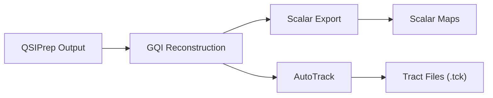

# DWI Processing (Stage 05)

Stage 05 preprocesses diffusion-weighted images with QSIPrep and performs fiber tract reconstruction with QSIRecon. The preprocessing corrects for head motion, eddy currents, and susceptibility distortion. The reconstruction stage applies generalized q-sampling imaging (GQI) and automated tractography to identify major white matter bundles, producing tract files and scalar maps used in downstream analysis.

## Run Command

To process all subjects:

```bash
bash 05_dwi_processing/qsiprep/submit_job_array.sh
```

To process a specific subject:

```bash
bash 05_dwi_processing/qsiprep/submit_job_array.sh sub-00123456
```

The script submits a SLURM job array with one task per subject. Concurrency is controlled by `QSIPREP_ARRAY_CONCURRENCY` in `config.sh` (default: 80).

## Processing Pipeline

### QSIPrep (Preprocessing)

QSIPrep performs the following on each subject's DWI data:

1. **Denoising** of the diffusion signal (Marchenko-Pastur PCA)
2. **Gibbs ringing removal**
3. **Head motion and eddy current correction** (FSL eddy)
4. **Susceptibility distortion correction** using fieldmaps (when available)
5. **B0 reference image estimation**
6. **Co-registration** to the T1w anatomical image
7. **Spatial normalization** to T1w space

### QSIRecon (Reconstruction)

QSIRecon applies a reconstruction workflow defined by the reconstruction specification file (`recon_spec.json`). The pipeline's specification defines a three-node DSI Studio workflow:



1. **GQI reconstruction** (`dsistudio_gqi`): estimates the spin distribution function at each voxel using generalized q-sampling imaging.
2. **Scalar export** (`scalar_export`): exports diffusion scalar maps (e.g., quantitative anisotropy, GFA) from the GQI results.
3. **AutoTrack** (`autotrackgqi`): automated tractography using DSI Studio's tract atlas, identifying bundles including the Fasciculus, Cingulum, Aslant tract, Corticospinal tract, Thalamic Radiation, Reticular tract, Optic radiation, Fornix, and Corpus Callosum.

The reconstruction specification is located at `05_dwi_processing/qsiprep/recon_spec.json` and referenced in `config.sh` as `QSIPREP_RECON_SPEC`. Key parameters:

| Parameter | Value | Purpose |
|-----------|-------|---------|
| `method` | `gqi` | Reconstruction algorithm |
| `track_id` | Multiple bundles | Target tract identifiers |
| `tolerance` | `22,26,30` | Angular tolerance for tract identification |
| `track_voxel_ratio` | `2.0` | Seeding density parameter |
| `space` | `T1w` | Output coordinate space |

## Inputs

| Input | Path | Description |
|-------|------|-------------|
| DWI images | `${BIDS_DIR}/sub-*/ses-*/dwi/*dwi.nii.gz` | Diffusion-weighted NIfTI files |
| b-value files | `${BIDS_DIR}/sub-*/ses-*/dwi/*dwi.bval` | Diffusion gradient magnitudes |
| b-vector files | `${BIDS_DIR}/sub-*/ses-*/dwi/*dwi.bvec` | Diffusion gradient directions |
| JSON sidecars | `${BIDS_DIR}/sub-*/ses-*/dwi/*dwi.json` | Acquisition metadata |
| QSIPrep container | `${QSIPREP_IMG}` | QSIPrep 0.20.0 Singularity image |
| Recon spec | `${QSIPREP_RECON_SPEC}` | JSON reconstruction workflow |
| FreeSurfer outputs | `${OUTPUT_DIR}/freesurfer_${FREESURFER_VERSION}/sub-*` | Optional; used by some recon workflows |

## Outputs

### QSIPrep outputs: `${OUTPUT_DIR}/qsiprep_${QSIPREP_VERSION}/`

```
qsiprep_0.20.0/
    sub-<id>.html                    # Visual QC report
    sub-<id>/
        ses-<ses>/
            dwi/
                ..._desc-preproc_dwi.nii.gz      # Preprocessed DWI
                ..._desc-preproc_dwi.bval
                ..._desc-preproc_dwi.bvec
```

### QSIRecon outputs: `${OUTPUT_DIR}/qsirecon_${QSIPREP_VERSION}/`

```
qsirecon_0.20.0/
    sub-<id>/
        ses-<ses>/
            dwi/
                ..._AutoTrackGQI.tck              # Tract files per bundle
                ..._gqiscalar.nii.gz              # GQI scalar maps
```

The tract files (`.tck` format) are used directly by Stage 07 for T1/T2 ratio extraction along white matter bundles.

## SLURM Resources (Per Subject)

| Parameter | Value |
|-----------|-------|
| Wall time | `2-00:00:00` (2 days) |
| Memory | `16 GB` |
| CPUs | `8` |
| Typical runtime | 3 to 12 hours per subject |

## Verification

1. Confirm per-subject HTML reports exist:
    ```bash
    ls ${OUTPUT_DIR}/qsiprep_${QSIPREP_VERSION}/sub-*.html | wc -l
    ```

2. Verify reconstruction outputs exist:
    ```bash
    ls -d ${OUTPUT_DIR}/qsirecon_${QSIPREP_VERSION}/sub-*/ses-*/dwi/ | head
    ```

3. Check for tract files from AutoTrack:
    ```bash
    find ${OUTPUT_DIR}/qsirecon_${QSIPREP_VERSION}/ -name "*AutoTrackGQI.tck" | wc -l
    ```

4. Inspect SLURM logs for completion. Successful runs end with the QSIPrep exit message.

## Common Issues

**Missing reconstruction specification.** If `QSIPREP_RECON_SPEC` in `config.sh` does not point to a valid JSON file, QSIRecon will fail. Verify the path:

```bash
cat ${QSIPREP_RECON_SPEC}
```

**FreeSurfer outputs expected but not found.** Some reconstruction workflows require FreeSurfer outputs. If the reconstruction step fails with a FreeSurfer-related error, ensure Stage 04a has completed and outputs are at `${OUTPUT_DIR}/freesurfer_${FREESURFER_VERSION}/`.

**Accidental cleanup of prior versions.** The `QSIPREP_PREVIOUS_VERSION_TO_CLEAN` variable in `config.sh` triggers automatic deletion of outputs from a prior QSIPrep version. If this is set incorrectly, it may delete outputs you intend to keep. Leave it empty to disable cleanup:

```bash
export QSIPREP_PREVIOUS_VERSION_TO_CLEAN=""
```

**Insufficient memory for large DWI datasets.** Multi-shell acquisitions with many directions may require more than 16 GB of memory. If jobs are killed by the OOM handler, increase the memory allocation in the submit script.

**Missing b-value or b-vector files.** QSIPrep requires `.bval` and `.bvec` files alongside the DWI NIfTI. If these are missing, the BIDS construction stage (Stage 01) may not have produced them correctly. Check the DWI directory for each subject:

```bash
ls ${BIDS_DIR}/sub-<id>/ses-*/dwi/
```
