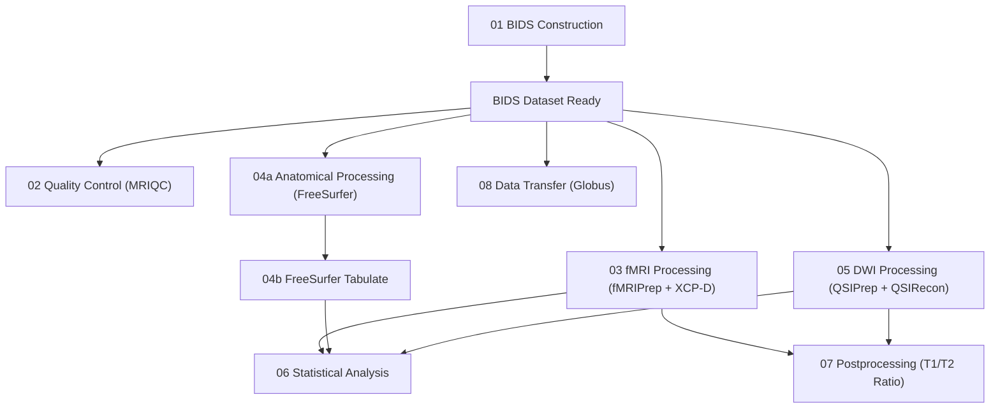

# MRI

This section documents the ROSMAP multi-modal MRI processing pipeline, which converts raw neuroimaging data into analysis-ready derivatives for structural, functional, and diffusion modalities. The pipeline is designed for SLURM-managed HPC clusters using containerized neuroimaging tools (fMRIPrep, FreeSurfer, QSIPrep, MRIQC) executed via Apptainer/Singularity.

## Pipeline Architecture

The pipeline consists of eight stages. After BIDS construction, quality control, functional, anatomical, and diffusion processing can run in parallel on the same BIDS dataset. Statistical analysis depends on outputs from the functional, anatomical, and diffusion stages. Postprocessing (T1/T2 ratio extraction) requires both fMRI and DWI derivatives. Data transfer can proceed as soon as the BIDS dataset is ready.



## Quick Start

After cloning the repository and editing `config.sh` for your environment:

```bash
# Stage 02: Quality control
bash 02_quality_control/mriqc/submit_job_array.sh

# Stage 03: Functional MRI processing
bash 03_fmri_processing/fmriprep_xcp/submit_job_array.sh

# Stage 04a: Anatomical processing (FreeSurfer)
bash 04_anatomical_processing/freesurfer/submit_job_array.sh

# Stage 05: Diffusion processing
bash 05_dwi_processing/qsiprep/submit_job_array.sh

# Stage 04b: FreeSurfer tabulation (after 04a completes)
bash 04_anatomical_processing/freesurfer_tabulate/submit_job_array.sh

# Stage 06: Statistical analysis (interactive notebooks)
jupyter lab

# Stage 07: Postprocessing
bash 07_postprocessing/t1t2_ratio/Pull_T1T2_ForcepsMinor_NoParallel.sh

# Stage 08: Data transfer
bash 08_data_transfer/Transfer_BIDS.sh
```

All submit scripts source `config.sh` automatically. No per-script path editing is required once `config.sh` is configured correctly.

## SLURM Resource Summary

| Stage | Time Limit | Memory | CPUs | Execution Mode |
|-------|-----------|--------|------|----------------|
| 02 MRIQC | 4 hours | 24 GB | 12 | Job array (per subject) |
| 03 fMRIPrep + XCP-D | 2 days | 16 GB | 4 | Job array (per subject) |
| 04a FreeSurfer | 2 days | 20 GB | 8 | Job array (per subject) |
| 04b FreeSurfer Tabulate | 3 days | 8 GB | 4 | Job array (per subject) |
| 05 QSIPrep + QSIRecon | 2 days | 16 GB | 8 | Job array (per subject) |
| 07 Postprocessing (serial) | 47 hours | 256 GB | 64 | Single job |
| 08 Data Transfer | 47 hours | 128 GB | 32 | Single job |

## Software Requirements

| Software | Version | Purpose |
|----------|---------|---------|
| MRIQC | 22.0.6 | Image quality metrics and reports |
| fMRIPrep | 23.2.0a3 | Functional MRI preprocessing |
| XCP-D | 0.6.0 | Post-fMRIPrep denoising and parcellation |
| FreeSurfer | 7.4.1 | Cortical surface reconstruction |
| QSIPrep | 0.20.0 | Diffusion preprocessing and reconstruction |
| neuromaps | 0.0.5dev | Atlas annotation and surface mapping |
| Apptainer/Singularity | Any | Container runtime |
| SLURM | Any | Job scheduling |

## Pipeline Sections

| Page | Description |
|------|-------------|
| [Scientific Background](background.md) | MRI modalities, containerized pipelines, and BIDS format rationale |
| [Environment Setup](setup.md) | Configuration, containers, FreeSurfer license, cluster requirements |
| [BIDS Construction](bids-construction.md) | Stage 01: converting raw data to BIDS format |
| [Quality Control](quality-control.md) | Stage 02: MRIQC participant-level reports |
| [fMRI Processing](fmri-processing.md) | Stage 03: fMRIPrep and XCP-D functional pipeline |
| [Anatomical Processing](anatomical-processing.md) | Stage 04: FreeSurfer recon-all and tabulation |
| [DWI Processing](dwi-processing.md) | Stage 05: QSIPrep preprocessing and QSIRecon tract reconstruction |
| [Statistical Analysis](statistical-analysis.md) | Stage 06: regression models across modalities |
| [Postprocessing](postprocessing.md) | Stage 07: T1/T2 ratio extraction along white matter tracts |
| [Data Transfer](data-transfer.md) | Stage 08: Globus-based transfer to external clusters |
