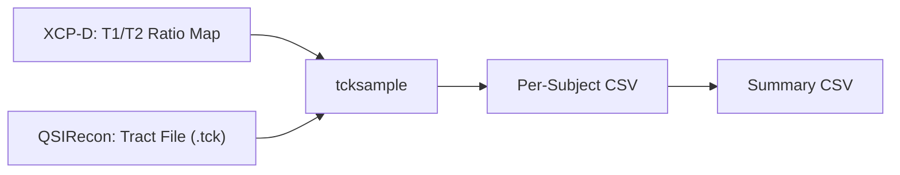

# Postprocessing (Stage 07)

Stage 07 extracts T1w/T2w ratio values along white matter tracts reconstructed in Stage 05. The T1w/T2w ratio serves as an in vivo proxy for myelin content; sampling this ratio along specific tract bundles quantifies microstructural integrity in a tract-specific manner. This stage uses MRtrix3's `tcksample` tool to map T1w/T2w ratio images onto the streamlines of the corpus callosum forceps minor.

## Processing Overview

For each subject, the pipeline:

1. Locates the T1w/T2w ratio map produced by XCP-D (Stage 03)
2. Locates the forceps minor tract file (`.tck`) produced by QSIRecon (Stage 05)
3. Runs `tcksample` to sample the T1w/T2w ratio along each streamline
4. Computes the mean T1w/T2w ratio across all streamlines for that subject
5. Writes per-subject results to individual CSVs and appends summary statistics to a cohort-level CSV



## Run Commands

Two execution modes are available: serial (single-job loop) and array (SLURM job array).

### Serial Mode (Recommended for Most Cases)

```bash
bash 07_postprocessing/t1t2_ratio/Pull_T1T2_ForcepsMinor_NoParallel.sh
```

This script loops over all subjects sequentially within a single SLURM job. It is simpler to manage and suitable when the total number of subjects is moderate.

### Array Mode

```bash
sbatch --array=0-99 07_postprocessing/t1t2_ratio/Pull_T1T2_ForcepsMinor.sh
```

Replace `0-99` with the appropriate range for your cohort size. This mode distributes subjects across multiple SLURM tasks, which is faster for large cohorts but requires more cluster resources.

## MRtrix Dependency

Both scripts activate a conda environment containing MRtrix3 at runtime. The following variables in `config.sh` must be configured:

```bash
export CONDA_SH_PATH="/path/to/anaconda/etc/profile.d/conda.sh"
export MRTRIX_CONDA_ENV="/path/to/conda_envs/MRtrix"
```

The `tcksample` command from MRtrix3 is the core tool used in this stage. It reads a tract file and a scalar image, then samples the image values at each point along each streamline, computing per-streamline statistics.

To verify MRtrix is installed correctly:

```bash
source "${CONDA_SH_PATH}"
conda activate "${MRTRIX_CONDA_ENV}"
tcksample --version
```

## Inputs

| Input | Path | Description |
|-------|------|-------------|
| T1/T2 ratio maps | `${XCP_DERIV_DIR}/sub-*/ses-*/anat/*T1wT2wRatio.nii.gz` | Myelin proxy maps from XCP-D |
| Tract files | `${QSIRECON_DERIV_DIR}/sub-*/ses-*/dwi/*CorpusCallosumForcepsMinor_AutoTrackGQI.tck` | Forceps minor streamlines |
| conda init script | `${CONDA_SH_PATH}` | For activating MRtrix environment |

The expected file naming pattern for the T1/T2 ratio map is:

```
sub-<id>_ses-<ses>_acq-mpr_run-1_space-MNI152NLin2009cAsym_desc-preproc_T1wT2wRatio.nii.gz
```

The expected tract file naming pattern is:

```
sub-<id>_ses-<ses>_acq-45dir_dir-AP_run-1_space-T1w_desc-preproc_bundle-CorpusCallosumForcepsMinor_AutoTrackGQI.tck
```

## Outputs

All outputs are written to `${T1T2_OUTPUT_DIR}` (defined in `config.sh`):

| Output | Description |
|--------|-------------|
| `sub-<id>_ses-<ses>_t1t2_stats.csv` | Per-streamline mean T1/T2 ratio for one subject |
| `t1t2_ratio_summary.csv` | Cohort summary: one row per subject with columns `subject_id`, `session_id`, `mean_t1t2_ratio` |

The per-subject CSV contains one row per streamline in the tract file, with the mean T1/T2 value sampled along that streamline. The summary CSV aggregates these into a single mean value per subject.

## SLURM Resources

### Serial Mode (`Pull_T1T2_ForcepsMinor_NoParallel.sh`)

| Parameter | Value |
|-----------|-------|
| Cores | `64` |
| Memory | `256 GB` |
| Wall time | `47:00:00` |

### Array Mode (`Pull_T1T2_ForcepsMinor.sh`)

| Parameter | Value |
|-----------|-------|
| Cores | `256` |
| Memory | `500 GB` |
| Wall time | `24:00:00` |

!!! note "Resource scaling"
    The serial script processes all subjects within a single job, so it requests a long wall time (47 hours) but moderate memory. The array script distributes work across tasks and can finish faster, but requests substantially more memory per task. Choose the mode that best fits your cluster's resource limits.

## Verification

1. Count per-subject CSV files in the output directory:
    ```bash
    ls ${T1T2_OUTPUT_DIR}/sub-*_t1t2_stats.csv | wc -l
    ```

2. Verify the summary CSV has the expected number of rows (one per processed subject, plus a header):
    ```bash
    wc -l ${T1T2_OUTPUT_DIR}/t1t2_ratio_summary.csv
    ```

3. Check that mean values in the summary CSV are non-empty and within a plausible range (typically between 0.5 and 2.0 for T1w/T2w ratios):
    ```bash
    column -t -s',' ${T1T2_OUTPUT_DIR}/t1t2_ratio_summary.csv | head -10
    ```

4. Review SLURM logs for `tcksample` success messages. Each subject should produce a "Successfully processed subject" line.

## Common Issues

**`tcksample` command not found.** This indicates the MRtrix conda environment is not configured correctly. Verify `CONDA_SH_PATH` and `MRTRIX_CONDA_ENV` in `config.sh`. Test the activation manually:

```bash
source "${CONDA_SH_PATH}" && conda activate "${MRTRIX_CONDA_ENV}" && which tcksample
```

**T1/T2 ratio file not found.** The script expects XCP-D outputs at specific paths. If XCP-D was not enabled during Stage 03 or the file naming differs, the script will skip those subjects with a warning. Verify XCP-D outputs exist:

```bash
find ${XCP_DERIV_DIR} -name "*T1wT2wRatio*" | head
```

**Tract file not found.** If QSIRecon did not produce forceps minor tract files for a subject, the AutoTrack step may have failed to identify that bundle. Check the QSIRecon output directory for that subject and review Stage 05 logs.

**Missing or NaN values in summary CSV.** If the `awk` parsing produces empty or NaN mean values, the per-subject CSV may contain no data rows (e.g., `tcksample` found no valid streamlines). Inspect the per-subject CSV directly to determine whether streamline sampling succeeded.
