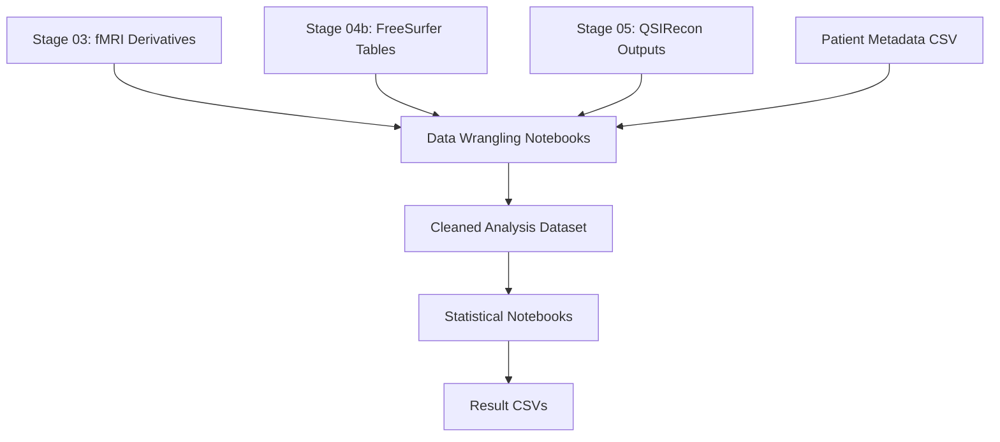

# Statistical Analysis (Stage 06)

Stage 06 consolidates derivative outputs from the functional, anatomical, and diffusion processing stages into regression-ready datasets and runs the statistical models that test associations between social isolation and brain imaging measures. This stage uses Jupyter notebooks for both data wrangling and model estimation.

## Workflow Overview

The analysis proceeds in two phases: data wrangling (assembling and cleaning the analysis dataset) and statistical modeling (fitting per-region and per-modality regression models). Both phases are run interactively through Jupyter.



## Running the Analysis

Launch Jupyter from the repository root:

```bash
jupyter lab
```

Then execute the notebooks in the following order.

### Phase 1: Data Wrangling

Open and run the notebooks in `06_statistical_analysis/data_wrangling/`:

| Notebook | Purpose |
|----------|---------|
| `slm_data_wrangle.ipynb` | Merges derivative imaging measures with participant metadata, applies inclusion/exclusion criteria, and produces the primary analysis dataframe |
| `slm_add_qc.ipynb` | Appends MRIQC quality metrics to the analysis dataframe for use as covariates or exclusion criteria |
| `site_check.ipynb` | Examines site-level distributions to identify potential batch effects |
| `Count_Patients.ipynb` | Reports sample sizes after each filtering step |

The wrangling notebooks read intermediate CSVs and write updated versions:

- `slm_data.csv` (initial merge)
- `slm_data2.csv` (after QC additions)
- `slm_data3.csv` (after site checks)
- `slm_data3_with_qc.csv` (final analysis-ready dataset)

### Phase 2: Statistical Modeling

Open and run the notebooks in `06_statistical_analysis/notebooks/`:

| Notebook | Purpose |
|----------|---------|
| `r_stats_Mahmoud.ipynb` | Primary regression models across all modalities |
| `r_stats_Mahmoud_AllRegions.ipynb` | Region-by-region analysis across all brain parcels |
| `r_stats_Mahmoud_HemiAveraged_r_stats.ipynb` | Hemisphere-averaged models to reduce multiple comparisons |
| `r_stats_Mahmoud_Figures.ipynb` | Figure generation for publication |
| `r_stats.ipynb` | Reference implementation of earlier model specifications |

The `Steve_Scripts/r_stats.ipynb` notebook contains an earlier version of the analysis and is retained for reference.

## Inputs

| Input | Source | Description |
|-------|--------|-------------|
| fMRI derivatives | `${OUTPUT_DIR}/xcp_d_${XCP_VERSION}/` | ALFF maps and denoised BOLD |
| Anatomical tables | `${OUTPUT_DIR}/freesurfer_tabulate/` | Per-subject brain measures and regional stats |
| DWI derivatives | `${OUTPUT_DIR}/qsirecon_${QSIPREP_VERSION}/` | Tract-level scalar measures |
| Patient metadata | `metadata/patient_metadata_3t_raw.csv` | Clinical, demographic, and social isolation data |
| Wrangling CSVs | `06_statistical_analysis/data_wrangling/*.csv` | Intermediate dataframes (from Phase 1) |
| Projection ID map | `06_statistical_analysis/data_wrangling/projid_dataframe.csv` | Links imaging subject IDs to ROSMAP project IDs |

## Outputs

Final model results are written to `06_statistical_analysis/results/`:

| Output File | Contents |
|-------------|----------|
| `ALFF_Results.csv` | Regression results for amplitude of low-frequency fluctuations (from resting-state fMRI) |
| `Anat_Results.csv` | Regression results for cortical thickness, surface area, and volumetric measures (from FreeSurfer) |
| `DWI_White_Matter_Results.csv` | Regression results for white matter tract-level measures (from QSIRecon) |
| `T1T2Ratio_Results.csv` | Regression results for T1w/T2w myelin ratio along tracts |

Each CSV contains columns for the brain region or tract, the regression coefficient for social isolation, standard error, p-value, and confidence intervals.

## Verification

After running all notebooks:

1. Confirm that all four result CSVs exist and are non-empty:
    ```bash
    wc -l 06_statistical_analysis/results/*.csv
    ```

2. Verify that all notebook cells executed without errors. In JupyterLab, cells with errors are marked with a red indicator.

3. Check that the number of rows in the result CSVs matches the expected number of brain regions or tracts for each modality.

4. If subject counts in the wrangling CSVs do not match expectations, re-examine the filtering criteria in `slm_data_wrangle.ipynb` and `slm_add_qc.ipynb`.

## Common Issues

**Import errors.** The notebooks require Python packages including `pandas`, `numpy`, `statsmodels`, `scipy`, and `matplotlib`. If imports fail, create a dedicated conda environment:

```bash
conda create -n mri_analysis python=3.10 pandas numpy statsmodels scipy matplotlib seaborn jupyter
conda activate mri_analysis
```

**Missing derivative files.** If the wrangling notebooks report missing imaging files, verify that Stages 03 through 05 completed successfully. Use `Count_Patients.ipynb` to identify which subjects are missing data from each modality.

**Subject count mismatch.** If the final analysis dataset has fewer subjects than expected, the filtering steps in the wrangling notebooks may be excluding subjects with incomplete data. Run the wrangling notebooks before the model notebooks to ensure the analysis dataframe is current.

**Stale intermediate CSVs.** If you re-run a subset of processing stages (e.g., re-process some subjects through fMRIPrep), rerun the wrangling notebooks from the beginning to pick up the updated derivative files. The intermediate CSVs (`slm_data.csv` through `slm_data3_with_qc.csv`) are not automatically refreshed.
