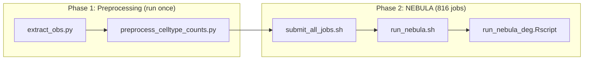

# Differential Expression Analysis

Differential expression gene (DEG) analysis identifies genes whose expression differs between phenotype groups within individual cell types. The repository supports two DEG approaches, each used for a different phenotype:

| Approach | Phenotype | Method | Environment |
|----------|-----------|--------|-------------|
| [NEBULA](#ace-deg-pipeline-nebula) | ACE (Adverse Childhood Experiences) | Single-cell mixed model with random effects | `nebulaAnalysis7` |
| [DESeq2/limma](#socisl-deg-pipeline-deseq2) | SocIsl (Social Isolation) | Traditional pseudobulk aggregation | `deg_analysis` |

---

## ACE DEG Pipeline (NEBULA)

The ACE DEG pipeline uses NEBULA (Negative Binomial mixed models Using Latent variables for Adjusting), a mixed-model framework that operates at the single-cell level rather than requiring explicit pseudobulk aggregation. NEBULA fits a negative binomial model with random effects to handle the non-independence of cells within subjects and the zero-inflation common in single-cell data.

### Why NEBULA Over Traditional Pseudobulk?

Traditional pseudobulk methods (DESeq2, edgeR) collapse all cells per patient per cell type into a single count vector, discarding within-patient cell-level variation. NEBULA instead:

- Operates on **individual cell counts** with a mixed model, preserving single-cell resolution
- Uses the **Hurdle-Logistic (HL)** method to handle zero-inflation in single-cell data
- Incorporates **random effects** on batch or subject to account for non-independence without collapsing cells
- Uses **edgeR TMM normalization offsets** (edgeR is used only for normalization, not the DE test)

### Scripts

All scripts are located in `Analysis/ACE/DEG/Tsai/scripts/`:

| Script | Purpose | Environment |
|--------|---------|-------------|
| `extract_obs.py` | Extract metadata from 83 GB h5ad via h5py (avoids loading full matrix) | `BATCHCORR_ENV` |
| `preprocess_celltype_counts.py` | Build per-cell-type h5ad files with raw counts from singlet files | `BATCHCORR_ENV` |
| `preprocess.sh` | SLURM orchestrator for both preprocessing steps | — |
| `run_nebula_deg.Rscript` | Core NEBULA DEG analysis (R) | `NEBULA_ENV` |
| `run_nebula.sh` | SLURM wrapper for a single NEBULA job | — |
| `submit_all_jobs.sh` | Batch submission of all 816 SLURM jobs | — |

### Analysis Dimensions

The pipeline tests all combinations of the following dimensions, producing 816 total SLURM jobs:

| Dimension | Values | Count |
|-----------|--------|-------|
| Traits | `early_hh_ses`, `tot_adverse_exp` | 2 |
| Batch correction pipeline | `flowcell_batch`, `projid_batch` | 2 |
| Trait encoding | `continuous`, `binary` | 2 |
| AD covariate | `niareagansc`, `cogdx` | 2 |
| Sex stratification | `all`, `female`, `male` | 3 |
| Cell types | See [cell type table](#cell-types) below | 17 |
| **Total** | 2 × 2 × 2 × 2 × 3 × 17 | **816** |

#### Dimension Details

**Traits:**

- `early_hh_ses` — Early household socioeconomic stress
- `tot_adverse_exp` — Total adverse childhood experiences (count of 5 ACE components: emotional neglect, family separation, financial need, parental intimidation, parental violence)

**Trait encoding:**

- `continuous` — Raw numeric value used directly
- `binary`:
    - `tot_adverse_exp`: >0 (exposed) vs. ==0 (not exposed)
    - `early_hh_ses`: Above median vs. below median

**Batch correction pipeline:**

- `flowcell_batch` — Uses NEBULA random effect on `derived_batch` (flowcell-based groups, ~41 levels). This pipeline uses the annotated h5ad from the standard integration (`03_Integrated/`).
- `projid_batch` — Uses NEBULA random effect on `projid` (subject ID, ~480 levels). This pipeline uses the alternate annotated h5ad from the projid-based integration (`03_Integrated_projid/`).

**AD covariates:** Either `niareagansc` (NIA-Reagan neuropathological staging) or `cogdx` (clinical cognitive diagnosis) is included as a fixed-effect covariate to adjust for AD severity.

**Sex stratification:**

- `all` — Both sexes included; `msex` added as a fixed-effect covariate
- `female` — Female subjects only (`msex == 0`); `msex` dropped from model
- `male` — Male subjects only (`msex == 1`); `msex` dropped from model

### Cell Types

| Category | Cell Types |
|----------|-----------|
| Glial | Oli, Ast, Mic, Endo, OPC |
| Excitatory neurons | Ex-L2/3, Ex-L4, Ex-L4/5, Ex-L5, Ex-L5/6, Ex-L5/6-CC, Ex-NRGN |
| Inhibitory neurons | In-VIP, In-SST, In-PV (Basket), In-PV (Chandelier), In-Rosehip |

### Workflow



#### Phase 1: Preprocessing

Run once via `preprocess.sh` to prepare per-cell-type count matrices for NEBULA.

**Step 1 — Extract metadata** (`extract_obs.py`):

Reads the annotated h5ad files (~83 GB each) using h5py to extract only the `obs` dataframe (cell_type, projid, derived_batch, sample_id, batch) and `var` names (HVG gene list) without loading the full expression matrix. Produces `obs.csv` and `var_names.csv`.

This is run twice: once for the flowcell-batch annotated h5ad and once for the projid-batch annotated h5ad.

**Step 2 — Build per-cell-type count matrices** (`preprocess_celltype_counts.py`):

For each of the 17 cell types:

1. Identifies annotated barcodes belonging to this cell type from `obs.csv`
2. Iterates over per-sample singlet h5ad files in `02_Doublet_Removed/`
3. Matches barcodes, extracts raw counts (sparse matrix)
4. Combines across all samples into a single per-cell-type h5ad file
5. Flags HVGs from the annotated h5ad's var list

Outputs: `{CellType}_rawcounts.h5ad` files in `${TSAI_DEG_READY}/{flowcell_batch,projid_batch}/`

#### Phase 2: NEBULA DEG

**`submit_all_jobs.sh`** iterates over all 816 combinations, checks for existing results (`nebula_*.rda`), and submits SLURM jobs via `run_nebula.sh`. Supports `--dry-run` mode.

Each job runs `run_nebula_deg.Rscript`, which:

1. Loads the per-cell-type h5ad via `zellkonverter::readH5AD()`
2. Loads and merges phenotype data (`${ACE_SCORES_CSV}`) by `projid`
3. Filters by sex (if stratified)
4. Drops cells with NA values in trait, age_death, or AD covariate
5. Encodes the trait variable (continuous or binary)
6. Sets up covariates: `age_death_scaled` (age at death / 10), AD covariate (numeric), optionally `msex_factor`
7. Filters to HVGs and removes zero-count genes
8. Sets the NEBULA random effect ID (`derived_batch` or `projid`)
9. Converts to NEBULA format via `scToNeb()` and `group_cell()`
10. Computes TMM normalization offsets via `edgeR::calcNormFactors()`
11. Runs `nebula()` with `method = "HL"`
12. Saves results and generates a volcano plot

### Statistical Model

```
gene ~ trait_var + age_death_scaled + ad_covariate [+ msex_factor]

Random effect:  derived_batch (flowcell pipeline) or projid (projid pipeline)
Method:         NEBULA Hurdle-Logistic (HL)
Normalization:  edgeR TMM offsets
FDR control:    Benjamini-Hochberg
Significance:   |logFC| > 0.6 AND padj < 0.1
```

### How to Run

```bash
# Source configuration
source config/paths.sh

# Phase 1: Preprocess (run once, ~12 hours)
cd Analysis/ACE/DEG/Tsai/
sbatch scripts/preprocess.sh

# Phase 2: Submit all NEBULA jobs (816 jobs, ~5h each)
bash scripts/submit_all_jobs.sh            # submit
bash scripts/submit_all_jobs.sh --dry-run  # preview without submitting
```

### Inputs

| File | Path Variable | Description |
|------|--------------|-------------|
| Annotated h5ad (flowcell) | `${TSAI_INTEGRATED}/tsai_annotated.h5ad` | Flowcell-batch integrated (~83 GB) |
| Annotated h5ad (projid) | `${TSAI_INTEGRATED_PROJID}/tsai_annotated.h5ad` | Projid-batch integrated (~83 GB) |
| Singlet h5ad files | `${TSAI_DOUBLET_REMOVED}/{projid}_singlets.h5ad` | Per-sample raw counts from Stage 2 |
| Phenotype CSV | `${ACE_SCORES_CSV}` | ACE trait scores for Tsai + DeJager patients |
| Derived batches CSV | `${TSAI_DERIVED_BATCHES_CSV}` | Projid-to-flowcell-batch mapping |

### Outputs

Results are organized by dimension: `Analysis/ACE/DEG/Tsai/{trait}/{pipeline}/{encoding}/{ad_covariate}/{sex}/`

| File | Description |
|------|-------------|
| `nebula_{CellType}.rda` | Full NEBULA model object (R) |
| `results_{CellType}.csv` | Per-gene results table |
| `volcano_{CellType}.png` | Volcano plot with top 15 significant genes labeled |

**Results CSV columns:**

| Column | Description |
|--------|-------------|
| `gene` | Gene symbol |
| `logFC` | Log fold change for the trait coefficient |
| `pval` | Nominal p-value |
| `padj` | Benjamini-Hochberg adjusted p-value |
| `neg_log10_pval` | −log10(pval), for plotting |
| `sig` | Boolean: `|logFC| > 0.6` AND `padj < 0.1` |

### Resource Requirements

| Phase | Script | Cores | Memory | Time |
|-------|--------|-------|--------|------|
| Preprocessing | `preprocess.sh` | 8 | 200 GB | 12 hours |
| NEBULA (per job) | `run_nebula.sh` | 45 | 100 GB | up to 5 hours |

!!! warning "NEBULA environment not in automated installer"
    The `nebulaAnalysis7` conda environment required for DEG analysis is referenced in `config/paths.sh` as `NEBULA_ENV` but is **not** created by `setup/install_envs.sh --analysis`. The `Analysis/envs/deg.yml` spec installs DESeq2/edgeR/limma, not NEBULA. You must create the NEBULA environment manually with the following R packages: `nebula`, `edgeR`, `zellkonverter`, `SingleCellExperiment`, `dplyr`, `ggplot2`, `ggrepel`.

---

## SocIsl DEG Pipeline (DESeq2)

The Social Isolation phenotype uses a traditional pseudobulk approach with DESeq2, predating the NEBULA pipeline.

### Method

1. Load the annotated AnnData object from Stage 3 of processing
2. For each cell type, aggregate raw counts across all cells per patient using `scran::aggregateAcrossCells()`
3. Fit a DESeq2 model with covariates

### Design Formula

```
~ age_death + pmi + social_isolation_avg + niareagansc
```

Analysis is sex-stratified: female (`msex == 0`) and male (`msex == 1`) are run separately rather than including sex as a covariate.

### Scripts

Scripts are in `Analysis/SocIsl/DEG/Tsai/`:

| Script | Purpose |
|--------|---------|
| `socIslDegT.Rscript` | Per-cell-type pseudobulk DEG via DESeq2 |
| `socIslDegCT.sh` | SLURM wrapper |

### Environment

Uses `deg_analysis` (from `Analysis/envs/deg.yml`), which provides DESeq2, edgeR, limma, and scanpy.

### Resource Requirements

| Parameter | Value |
|-----------|-------|
| Cores | 8 |
| Memory | 64 GB |
| Time | 1 to 2 hours |
