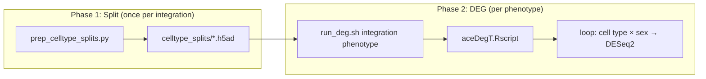

# Differential Expression Analysis

Differential expression gene (DEG) analysis identifies genes whose expression differs between phenotype
groups within individual cell types. The repository implements DEG for two phenotypes, both using the
**same pseudobulk + DESeq2** approach:

| Phenotype | Cohorts | Method | Environment |
|-----------|---------|--------|-------------|
| [ACE](#ace-deg-pipeline) (Adverse Childhood Experiences) | Tsai + DeJager | Pseudobulk aggregation → DESeq2 | `nebulaAnalysis7` (legacy name) |
| [SocIsl](#socisl-deg-pipeline) (Social Isolation) | Tsai + DeJager | Pseudobulk aggregation → DESeq2 | `deg_analysis` |

!!! warning "The environment name `nebulaAnalysis7` is legacy"
    The ACE DEG conda environment is called `nebulaAnalysis7` and is referenced as `NEBULA_ENV` in
    `config/paths.sh`, but **the pipeline does not use the NEBULA single-cell mixed-model framework** —
    it runs DESeq2 on pseudobulk counts (`aceDegT.Rscript`). The name is a holdover from an earlier
    design. The environment **is** created automatically by `setup/install_envs.sh --analysis` (built from
    `envs/analysis/nebula/environment.yml`); you do not need to create it manually.

---

## ACE DEG Pipeline

The ACE DEG pipeline aggregates single cells into per-patient pseudobulk profiles and fits a DESeq2 model
per cell type and sex. It is implemented for **both cohorts**: `Analysis/ACE/DEG/Tsai/` (driver) and
`Analysis/ACE/DEG/DeJager/` (which `source()`s the Tsai R script, so the method is identical).

### Why Pseudobulk DESeq2?

Single-nucleus DE can be run at the single-cell level (e.g. mixed models) or by **pseudobulking** —
summing each patient's raw counts within a cell type into one profile, then running a standard bulk
RNA-seq test. This pipeline pseudobulks for several reasons:

- **Correct unit of replication.** The biological replicate in ROSMAP is the *patient*, not the cell.
  Treating thousands of cells from one donor as independent samples inflates significance
  (pseudoreplication). Aggregating to one count vector per patient makes the donor the unit of analysis,
  which is what bulk methods like DESeq2 assume.
- **Well-calibrated and benchmarked.** Pseudobulk + DESeq2/edgeR is consistently among the best-calibrated
  approaches in single-cell DE benchmarks, controlling false positives better than naive per-cell tests.
- **Robust to ambient/technical noise.** Summing counts averages out per-cell dropout and residual
  ambient signal before the test.

Within-patient structure (sex, AD pathology) is handled by **stratifying** (separate models per sex) and
by **covariates** (see the design formula), not by random effects.

### Scripts

All scripts live directly in `Analysis/ACE/DEG/Tsai/` (there is **no** `scripts/` subdirectory):

| Script | Purpose |
|--------|---------|
| `prep_celltype_splits.py` | Split the annotated h5ad into per-cell-type raw-count h5ad files (run once per integration) |
| `aceDegT.Rscript` | Core analysis: pseudobulk aggregation + DESeq2 per cell type × sex |
| `run_deg.sh` | SLURM wrapper: `run_deg.sh <integration> <phenotype> [celltype]` |
| `aceDegT.sh` | Batch launcher over phenotypes for a given integration |
| `run_male_ad_models.sh` | Orchestrator for the male AD-confounding sensitivity arms (see [below](#ad-confounding-sensitivity-arms)) |
| `smoke_test.sh` | Fixture-based smoke test (no protected data) |

The DeJager equivalents are in `Analysis/ACE/DEG/DeJager/` (`aceDegDJ.Rscript`, `aceDegDJ.sh`,
`run_deg.sh`); `aceDegDJ.Rscript` simply `source()`s `../Tsai/aceDegT.Rscript`.

### Analysis Dimensions

A single `aceDegT.Rscript` run is parameterized by **integration** and **phenotype**; it then iterates over
**cell types** and **sex** *internally*. So the number of submitted jobs is small — roughly
`integrations × phenotypes` — not a large cross-product.

| Dimension | Values | Where it varies |
|-----------|--------|-----------------|
| Integration (input h5ad) | Tsai: `derived_batch` (default), `projid`; DeJager: `library_id` | `--integration` arg (one job each) |
| Phenotype | `tot_adverse_exp`, `early_hh_ses`, `ace_aggregate` | `--phenotype` arg (one job each) |
| Sex | `Fem` (`msex==0`), `Male` (`msex==1`) | looped **inside** the R script |
| Cell type | broad groups (`broad_Exc`, `broad_Inh`, glial) + individual subtypes | looped **inside** the R script (one h5ad per type) |

A typical full ACE Tsai run is therefore **3 phenotypes × {derived_batch, projid} = 6** `aceDegT.Rscript`
invocations (plus one `prep_celltype_splits.py` per integration); DeJager adds 3 more for `library_id`.

#### Phenotype Encodings

- `tot_adverse_exp` — total adverse childhood experiences (count of ACE components), used as a continuous
  numeric covariate.
- `early_hh_ses` — early household socioeconomic status, continuous.
- `ace_aggregate` — a derived composite computed in the R script as
  `scale(tot_adverse_exp) − scale(early_hh_ses)` (z-scored adversity minus z-scored SES).

#### Cell-Type Splitting (`prep_celltype_splits.py`)

`prep_celltype_splits.py` reads the annotated `tsai_annotated.h5ad` for the chosen integration and writes
one raw-count `.h5ad` per cell type into `celltype_splits_<integration>/`. Subtypes are also grouped into
broad classes for the high-level analysis: any `Ex-*` cell type maps to `broad_Exc`, any `In-*` to
`broad_Inh`, and glial types (Oli, Ast, Mic, OPC, Endo, …) are carried through as-is. `aceDegT.Rscript`
processes the `broad_*` files first, then the individual subtype files.

### Workflow


```mermaid
graph LR
    subgraph "Phase 1: Split (once per integration)"
        A1[prep_celltype_splits.py] --> A2["celltype_splits/*.h5ad"]
    end
    subgraph "Phase 2: DEG (per phenotype)"
        B1["run_deg.sh integration phenotype"] --> B2[aceDegT.Rscript]
        B2 --> B3["loop: cell type × sex → DESeq2"]
    end
    A2 --> B1
```

For each cell type and each sex, `aceDegT.Rscript`:

1. Loads the per-cell-type h5ad via `zellkonverter::readH5AD()` and renames the `X` assay to `counts`.
2. Merges ACE phenotype data (`${ACE_SCORES_CSV}`) onto cells by `projid`; drops cells with no ACE score.
3. Splits by sex (`msex == 0` / `== 1`); skips a stratum with `< 10` cells or `< 5` patients.
4. **Pseudobulks** with `scran::aggregateAcrossCells(ids = projid)` — one summed count vector per patient.
5. z-scales `age_death` and `pmi`; coerces `niareagansc` and the phenotype to numeric.
6. Fits DESeq2 with the design formula below and extracts the phenotype coefficient via
   `results(dds, name = phenotype)`.
7. Saves the pseudobulk object (`pseudobulk_ACE_{sex}_{celltype}.rds`) and the DESeq2 result
   (`deseqAnalysisACE_{phenotype}_{celltype}_{sex}.rda`).

### Statistical Model

```
~ age_death + pmi + <phenotype> + niareagansc

Aggregation:   scran::aggregateAcrossCells by projid (per-patient pseudobulk)
Test:          DESeq2 (negative binomial GLM, Wald test on the phenotype coefficient)
Stratified by: sex (Fem / Male run as separate models)
FDR control:   Benjamini-Hochberg (DESeq2 default)
Significance:  padj < 0.05
```

#### Why these covariates, and why stratify by sex?

- `age_death` and `pmi` (post-mortem interval) are standard nuisance covariates in post-mortem brain DE —
  both shift transcript abundance and degradation independent of the phenotype.
- `niareagansc` (NIA-Reagan neuropathological AD score) adjusts for Alzheimer's pathology, so the phenotype
  coefficient reflects the ACE association *over and above* AD burden.
- **Sex is stratified, not modeled as a covariate**, because the ACE literature and prior ROSMAP work show
  sex-specific effects; a single pooled model with `msex` as a covariate would assume the phenotype effect
  is identical in both sexes. Separate `Fem`/`Male` models let the effect differ. (The dedicated
  AD-confounding arms below extend this with male-specific AD-adjustment variants.)

DESeq2 has **no random effects** in this code; non-independence of cells is removed by the pseudobulk step,
and `padj < 0.05` is the sole significance threshold.

### AD-Confounding Sensitivity Arms

Because ACE and AD pathology are correlated, the male analysis is repeated under several AD-adjustment
schemes to test whether ACE associations are robust to how AD is controlled. These arms are orchestrated by
`run_male_ad_models.sh` and implemented as the `aceDegT_Male*` script variants (e.g. `MaleNoADadj`,
`MaleContAD`, `MaleBinaryAD`, `MaleNiaReagan`, `MaleAncovaAD`, `MaleAceByAD`), each differing only in the AD
term(s) in the design formula:

```bash
cd Analysis/ACE/DEG/Tsai
bash run_male_ad_models.sh        # submits the male AD-adjustment arms per cell type
```

### How to Run

```bash
source config/paths.sh

# Phase 1 + 2 — build per-cell-type splits and submit all phenotypes for Tsai
cd Analysis/ACE/DEG/Tsai
sbatch aceDegT.sh
# (or, for a single phenotype:)
sbatch run_deg.sh derived_batch tot_adverse_exp

# DeJager (same method, library_id integration)
cd ../DeJager
sbatch aceDegDJ.sh
```

### Inputs

| File | Path Variable | Description |
|------|--------------|-------------|
| Annotated h5ad | `${TSAI_INTEGRATED}/tsai_annotated.h5ad` (per integration) | Source for cell-type splitting |
| Per-cell-type splits | `celltype_splits_<integration>/<celltype>.h5ad` | Raw counts per cell type (Phase 1 output) |
| Phenotype CSV | `${ACE_SCORES_CSV}` | ACE trait scores keyed by `projid` |

### Outputs

Results are written under `results_<integration>/<phenotype>/`:

| File | Description |
|------|-------------|
| `pseudobulk_ACE_{sex}_{celltype}.rds` | Per-patient pseudobulk `SingleCellExperiment` (inputs to DESeq2) |
| `deseqAnalysisACE_{phenotype}_{celltype}_{sex}.rda` | DESeq2 `results()` object for the phenotype coefficient |

Each `.rda` holds a standard DESeq2 results table. The key columns:

| Column | Description |
|--------|-------------|
| `baseMean` | Mean normalized count across patients |
| `log2FoldChange` | Effect of the phenotype on expression (per unit, log2 scale) |
| `lfcSE` | Standard error of the log2 fold change |
| `pvalue` | Wald-test nominal p-value |
| `padj` | Benjamini-Hochberg adjusted p-value (significance at `padj < 0.05`) |

Example rows from a DESeq2 result (one cell type, `tot_adverse_exp`, Male):

```text
gene      baseMean   log2FoldChange   lfcSE    pvalue     padj
GENE_A     842.1        0.61           0.14    1.2e-05    0.0038   # significant
GENE_B     310.7        0.29           0.16    6.4e-02    0.21     # marginal
GENE_C    1204.5       -0.04           0.11    7.1e-01    0.95     # not significant
```

A positive `log2FoldChange` means expression rises with the phenotype value (here, more adverse
experiences); the magnitude is per one-unit increase in the (scaled) phenotype.

### Resource Requirements

| Phase | Script | Cores | Memory | Time |
|-------|--------|-------|--------|------|
| Split | `prep_celltype_splits.py` (via `aceDegT.sh`) | varies | high (reads ~80 GB h5ad) | a few hours |
| DEG | `run_deg.sh` | 4 | 200 GB | up to 24 hours |

!!! note "Very large cell types"
    For the most abundant cell types, the per-cell-type h5ad can exceed R's sparse-matrix limit (2³¹
    nonzeros). `aceDegT.Rscript` detects this, skips the type, and points to
    `legacy/pseudobulk_broad_Exc.py` for a Python-side pseudobulk of those cases.

---

## SocIsl DEG Pipeline

The Social Isolation phenotype uses the same pseudobulk + DESeq2 approach, in `Analysis/SocIsl/DEG/`
(Tsai and DeJager).

### Method

1. Load the annotated AnnData object from Stage 3 of processing.
2. For each cell type, aggregate raw counts across all cells per patient (pseudobulk).
3. Fit a DESeq2 model with the design formula below.

### Design Formula

```
~ age_death + pmi + social_isolation_avg + niareagansc
```

As in the ACE pipeline, analysis is **sex-stratified** (female `msex == 0` and male `msex == 1` run
separately) rather than including sex as a covariate.

### Environment

Uses `deg_analysis` (spec: `envs/analysis/deg/environment.yml`), which provides DESeq2, edgeR, limma, and
scanpy.

### Resource Requirements

| Parameter | Value |
|-----------|-------|
| Cores | 8 |
| Memory | 64 GB |
| Time | 1 to 2 hours (per cell type) |
