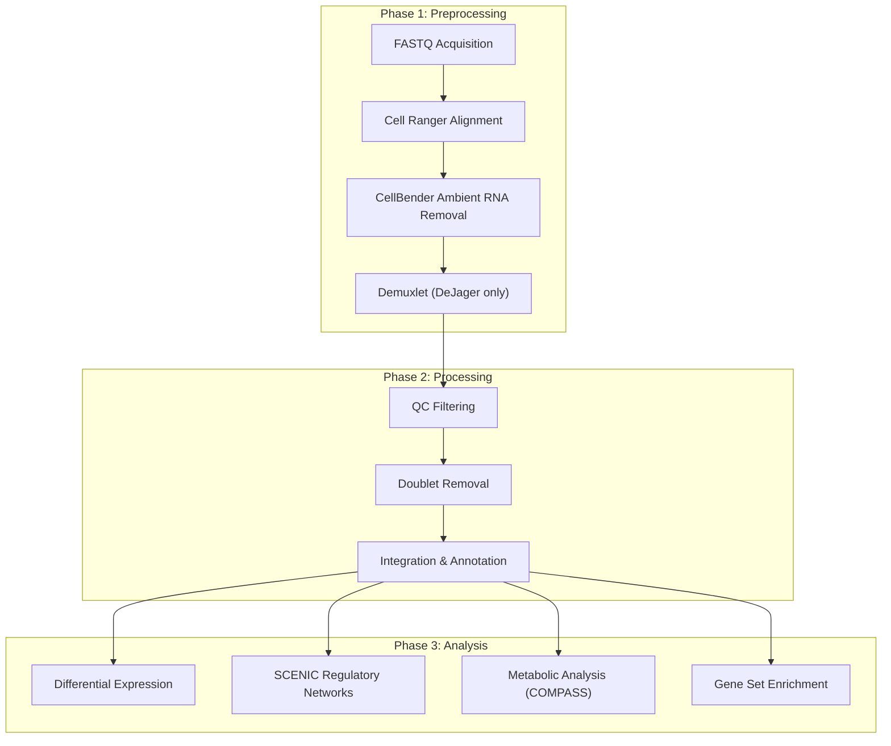

# Single Nucleus RNA Sequencing

This section documents the ROSMAP single nucleus RNA sequencing (snRNA-seq) pipeline, which processes dorsolateral prefrontal cortex (DLPFC) tissue samples from postmortem brain to generate cell type-annotated gene expression data for downstream biological analysis.

## Pipeline Architecture

The pipeline is organized into three sequential phases. Preprocessing converts raw sequencing reads into ambient RNA-corrected count matrices. Processing applies quality control, doublet removal, and batch-corrected integration to produce a single annotated dataset. Analysis then uses that dataset for differential expression, regulatory network inference, metabolic pathway analysis, and gene set enrichment.

## Datasets

The pipeline handles two independently collected ROSMAP snRNA-seq datasets. Both follow the same core processing steps, but differ in data acquisition and sample assignment.

| Property | DeJager | Tsai |
|----------|---------|------|
| Source | Synapse (syn21438684) | MIT Engaging cluster |
| Library design | Multiplexed (multiple patients per library) | One patient per library |
| Sample assignment | Demuxlet genotype demultiplexing with WGS data | Known from sequencing metadata |
| Patient count | ~200 libraries | 480 patients |
| FASTQ files | Downloaded via Synapse Python client | ~5,197 files (~9 TB), transferred via Globus |
| Extra preprocessing step | Demuxlet/Freemuxlet (Step 4) | None |
| Cohorts | Mixed | ACE, Resilient, SocIsl |
| Processing batches | Single pass | 16 batches of 30 patients |

## Final Output

The pipeline produces an annotated AnnData object (e.g., `tsai_annotated.h5ad`) containing:

- Single-cell gene expression matrices, filtered and quality-controlled
- Cell type annotations derived from over-representation analysis using Mohammadi 2020 prefrontal cortex markers
- Batch-corrected PCA and UMAP embeddings (Harmony-adjusted)
- Patient, batch, and clinical metadata per cell

This object serves as the input for all downstream analyses.

You do not need to run every phase. If you already have preprocessed data (e.g., CellBender outputs or the annotated H5ad), you can enter the pipeline at any stage. See [Data Access](data-access.md) for how to download data and choose your starting point.

## Pipeline Sections

| Page | Description |
|------|-------------|
| [Scientific Background](background.md) | ROSMAP, DLPFC, snRNA-seq rationale, and justification for each pipeline method |
| [Environment Setup](setup.md) | Repository clone, path configuration, software installation, conda environments |
| [Data Access](data-access.md) | Data directory layout, transfer methods, and choosing your pipeline entry point |
| [Preprocessing Overview](preprocessing/index.md) | FASTQ-to-CellBender workflow and dataset-specific differences |
| [FASTQ Acquisition](preprocessing/fastq-acquisition.md) | Synapse download (DeJager) and Engaging cluster discovery (Tsai) |
| [Cell Ranger](preprocessing/cellranger.md) | Read alignment and gene expression counting |
| [CellBender](preprocessing/cellbender.md) | GPU-accelerated ambient RNA removal |
| [Demuxlet](preprocessing/demuxlet.md) | WGS-based genotype demultiplexing (DeJager only) |
| [Processing Overview](processing/index.md) | Three-stage pipeline architecture and submission |
| [QC Filtering](processing/qc-filtering.md) | Percentile-based quality control thresholds |
| [Doublet Removal](processing/doublet-removal.md) | scDblFinder-based computational doublet detection |
| [Integration and Annotation](processing/integration-annotation.md) | Normalization, HVG selection, PCA, Harmony, clustering, and cell type annotation |
| [Analysis Overview](analysis/index.md) | Analysis types, phenotype status, environments, and directory structure |
| [Differential Expression](analysis/deg.md) | NEBULA (ACE) and DESeq2 (SocIsl) DEG pipelines |
| [SCENIC](analysis/scenic.md) | pySCENIC regulatory network inference (SocIsl) |
| [TF and Metabolic Analysis](analysis/tf-analysis.md) | COMPASS metabolic flux analysis (SocIsl) |
| [Gene Set Enrichment](analysis/gsea.md) | WebGestaltR pathway enrichment (SocIsl) |
| [Troubleshooting](troubleshooting.md) | Common errors, resource requirements, and known issues |

## Software Requirements

| Software | Version | Purpose |
|----------|---------|---------|
| Cell Ranger | v8.0.0 | Read alignment and counting |
| CellBender | Latest | Ambient RNA removal (GPU required) |
| Python | 3.10+ | QC filtering, integration, annotation (scanpy, anndata, harmonypy, decoupler) |
| R | 4.2+ | Doublet removal (scDblFinder), DEG analysis (NEBULA, DESeq2, edgeR), GSEA (WebGestaltR) |
| pySCENIC | 0.12+ | Gene regulatory network inference (SCENIC analysis) |
| COMPASS | 0.9+ | Metabolic flux estimation (requires IBM CPLEX) |
| Singularity | 3.10+ | Demuxafy container for Demuxlet (DeJager only) |
| SLURM | Any | Job scheduling and resource management |
