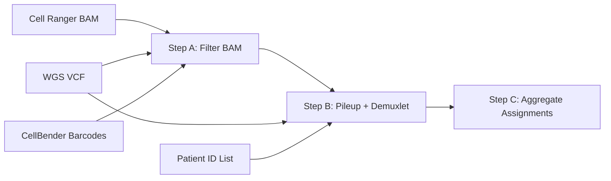

# Demuxlet (DeJager Only)

The DeJager snRNA-seq libraries are multiplexed: each library contains cells from multiple patients pooled before sequencing. Demuxlet uses whole-genome sequencing (WGS) genotype data to computationally assign each cell barcode to its patient of origin. This step is not required for the Tsai dataset, where patient identity is known from sequencing metadata.

## Why Demuxlet Is Needed

In a multiplexed library, the 10x Chromium device captures nuclei from multiple patients in the same channel. Cell Ranger processes all reads together and produces a single count matrix, but it cannot distinguish which cell belongs to which patient. The only way to resolve patient identity is to compare the single nucleotide polymorphisms (SNPs) observed in each cell's RNA reads against the patients' known WGS genotypes.

Demuxlet performs this comparison probabilistically, assigning each cell barcode to the patient whose genotype best explains the observed alleles. It also identifies doublets (droplets containing nuclei from two patients) and ambiguous cells.

## Methods

| Method | Type | Genotype Requirement | Used In Production |
|--------|------|---------------------|-------------------|
| Demuxlet | Reference-based | WGS VCF required | Yes |
| Freemuxlet | Reference-free | No genotypes needed | Testing only |

Demuxlet was chosen for production because WGS data is available for all ROSMAP patients, providing substantially higher accuracy than the reference-free Freemuxlet approach.

## Workflow

The demuxlet pipeline has three steps, submitted as separate SLURM jobs or combined into a single job for individual libraries:



### Step A: BAM Filtering (~3 hours)

The Cell Ranger possorted BAM is filtered to keep only reads that:

- Overlap with SNP positions in the VCF file
- Have a valid cell barcode from the CellBender output

This filtering dramatically reduces the BAM file size (often 10-50x), making pileup generation tractable within reasonable memory and time constraints.

**Tool:** `popscle_helper_tools/filter_bam_file_for_popscle_dsc_pileup.sh`

**Dependencies:** samtools (>= 1.10), bedtools

### Step B: Pileup + Demuxlet (~36 hours)

Two operations run in sequence:

1. **Pileup generation** (`popscle dsc-pileup`): Counts alleles at SNP positions for each cell barcode, producing per-cell allele count matrices.
2. **Demuxlet** (`popscle demuxlet`): Uses the pileup data and WGS genotype likelihoods to probabilistically assign each cell to a patient.

**Tool:** Demuxafy Singularity container (`Demuxafy.sif`) containing the popscle toolkit.

**Dependencies:** Singularity

### Step C: Post-processing (~5 minutes)

Aggregates all per-library `demux1.best` files into a single CSV mapping each cell barcode to its assigned patient across all libraries.

**Tool:** `postprocess_assignments.py`

## Prerequisites

### Singularity Container

The Demuxafy container provides the popscle toolkit (pileup and demuxlet):

```bash
# Check that the container is available
ls "${DEMUXAFY_SIF}"

# To build from scratch
module load openmind/singularity/3.10.4
singularity build Demuxafy.sif docker://drneavin/demuxafy:latest
```

### WGS VCF

The SNP-only, GRCh38-lifted VCF must be available and indexed:

```bash
ls "${DEJAGER_DEMUX_VCF}"
# Expected: snp_fixedconcatenated_liftedROSMAP.vcf.gz (~84 GB)
```

See `docs/VCF_PREPARATION.md` in the repository for documentation on how this VCF was prepared from per-chromosome ROSMAP WGS files (liftover, SNP filtering, concatenation, indexing).

### Patient ID Lists

Each library requires a text file listing the WGS sample IDs of patients in that library (one `SM-*` ID per line):

```bash
ls "${DEJAGER_PATIENT_IDS_DIR}/individPat${LIBRARY_ID}.txt"
```

### Previous Steps Complete

Demuxlet requires outputs from both Cell Ranger and CellBender:

| Input | Source | Path |
|-------|--------|------|
| Possorted BAM | Cell Ranger (Step 02) | `${DEJAGER_COUNTS}/{LibID}/outs/possorted_genome_bam.bam` |
| Cell barcodes | CellBender (Step 03) | `${DEJAGER_CELLBENDER}/{LibID}/processed_feature_bc_matrix_cell_barcodes.csv` |
| SNP VCF | WGS data (external) | `${DEJAGER_DEMUX_VCF}` |
| Patient IDs | WGS metadata (external) | `${DEJAGER_PATIENT_IDS_DIR}/individPat{LibID}.txt` |

## Key Parameters

| Parameter | Value | Rationale |
|-----------|-------|-----------|
| `--alpha` | 0.05 | Prior for ambient RNA fraction; balances sensitivity vs. specificity |
| `--min-mac` | 1 | Minimum minor allele count; increasing to 5 drops accuracy to 0.61 |
| `--doublet-prior` | 0.1 | Prior probability of doublets; 10% matches the expected 10x doublet rate |
| `--field` | `PL` | Use Phred-scaled genotype likelihoods from the WGS VCF |

See `docs/PARAMETER_TUNING.md` in the repository for full parameter sweep results and the rationale behind each choice.

## Usage

### Option 1: Run All Libraries (Batch)

```bash
source config/paths.sh
cd Preprocessing/DeJager/04_Demuxlet_Freemuxlet
sbatch Demuxlet_DeJager.sh
```

This generates per-library scripts and submits them to SLURM.

### Option 2: Run a Single Library

```bash
# Edit LIBRARY_ID in example_demuxlet.sh
sbatch example_demuxlet.sh
```

### Option 3: Step-by-Step

```bash
source config/paths.sh

# Generate and submit BAM filter scripts only
python Demuxlet_DeJager.py --bam-only --submit

# After BAM jobs complete, generate and submit demuxlet scripts
python Demuxlet_DeJager.py --demux-only --submit

# After demuxlet jobs complete, aggregate results
python postprocess_assignments.py \
    --wgs-dir "${DEJAGER_WGS_DIR}" \
    --output cell_to_patient_assignments.csv
```

### Option 4: Dry Run (Generate Without Submitting)

```bash
python Demuxlet_DeJager.py --all
# Scripts are written to ${DEJAGER_WGS_DIR}/generated_scripts/ but not submitted
```

## Output

### Per-Library Output

Each library produces the following files in `${DEJAGER_WGS_DIR}/{LibraryID}/`:

| File | Description |
|------|-------------|
| `BAMOutput1.bam` | Filtered BAM (Step A output) |
| `BAMOutput1.bam.csi` | BAM index |
| `plpDemux1.cel.gz` | Pileup cell file |
| `plpDemux1.plp.gz` | Pileup data (allele counts per SNP per cell) |
| `plpDemux1.var.gz` | Pileup variant information |
| `demux1.best` | Cell-patient assignments (Step B output) |

### Assignment File Format (`demux1.best`)

| Column | Description |
|--------|-------------|
| `BARCODE` | Cell barcode |
| `NUM.SNPS` | Number of SNPs covering this cell |
| `NUM.READS` | Number of reads at SNP positions |
| `DROPLET.TYPE` | `SNG` (singlet), `DBL` (doublet), `AMB` (ambiguous) |
| `BEST.GUESS` | Best patient assignment (comma-separated pair if doublet) |
| `BEST.LLK` | Log-likelihood for best assignment |
| `DIFF.LLK.BEST.NEXT` | Log-likelihood difference between best and next-best |

### Aggregated Output (Step C)

`cell_to_patient_assignments.csv` with columns: Cell Barcode, Assigned Patient, Library.

## Validation

To validate demuxlet results against known cell annotations (if available):

```bash
python validate_demuxlet.py \
    --demux-file ${DEJAGER_WGS_DIR}/191121-B6/demux1.best \
    --annotation-file cell-annotation.csv \
    --library-id 191121-B6 \
    --output-dir results/
```

This computes Adjusted Rand Index (ARI), Normalized Mutual Information (NMI), and generates a confusion matrix heatmap.

## Resource Requirements

| Step | Cores | Memory | Time | Scope |
|------|-------|--------|------|-------|
| A. BAM Filter | 45 | 400 GB | 3 hours | Per library |
| B. Pileup + Demuxlet | 10 | 500 GB | 36 hours | Per library |
| C. Post-processing | 1 | 8 GB | 5 minutes | All libraries |
| Batch generator | 1 | 4 GB | < 1 hour | Once |

!!! warning "Memory Requirements"
    Pileup generation on large libraries can approach 500 GB of RAM. Monitor jobs and increase `--mem` if needed. The BAM filtering step (Step A) also requires substantial memory (400 GB) due to the size of the VCF file.

## Special Cases

### "Alone" Libraries

Libraries containing "alone" in their name (e.g., `191122-B6-R1969233-alone`) are single-patient libraries created by splitting. They are automatically excluded from batch processing because they do not require demultiplexing. Their patient IDs are handled via `Processing/DeJager/Pipeline/Resources/patient_id_overrides.json`.

### Singularity Bind Mounts

The `--bind` flag maps the WGS directory to `/mnt` inside the container. Cell barcode files must be accessible at `/mnt/processed_feature_bc_matrix_cell_barcodes_{LibID}.csv`.

## Troubleshooting

**No cells assigned.** Check that the VCF contains the `PL` field (`bcftools query -l your.vcf.gz`), that patient IDs match between VCF sample names and the `individPat*.txt` files, and that barcodes are in the correct format (no header, one per line).

**Too many doublets.** Check library quality metrics from Cell Ranger. Consider lowering `--doublet-prior`.

**Low assignment confidence.** Verify BAM/VCF chromosome naming consistency (both must use the same convention, e.g., `chr1` vs. `1`). Use the SNP-only VCF, not the full variant VCF. Ensure the VCF is properly indexed: `tabix -p vcf your.vcf.gz`.

**Pileup runs out of memory.** Ensure BAM filtering (Step A) completed successfully. If the filtered BAM is still very large, the VCF may contain too many variants. Increase `--mem` in the SLURM script.
