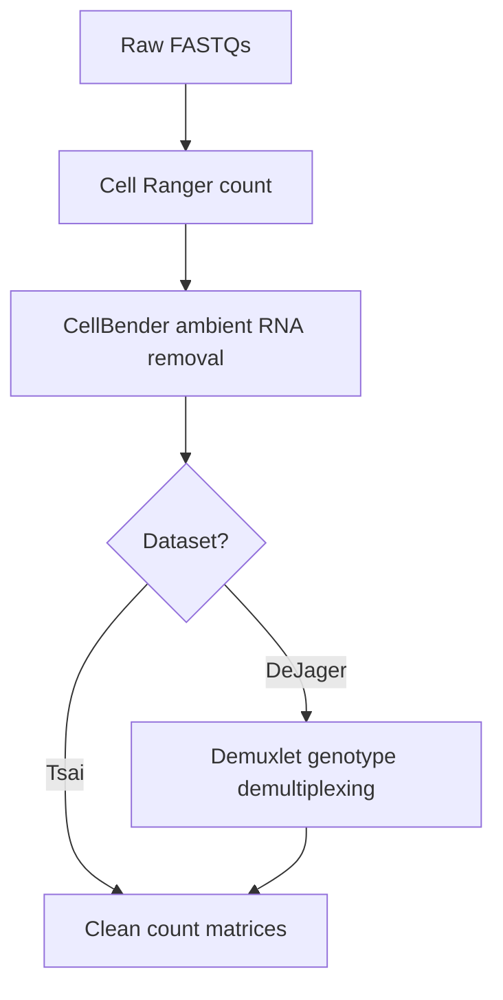

# Preprocessing Overview

Preprocessing converts raw FASTQ sequencing files into ambient RNA-corrected count matrices suitable for downstream quality control and analysis. This phase handles data acquisition, read alignment, ambient RNA removal, and (for the DeJager dataset) genotype-based sample demultiplexing.

!!! tip "Already have preprocessed data?"
    If you have CellRanger or CellBender outputs, you can skip some or all preprocessing steps. See [Data Access](../data-access.md) for download instructions and choosing your entry point.

## Workflow

The core workflow is the same for both datasets: FASTQs are aligned with Cell Ranger, then ambient RNA is removed with CellBender. The DeJager dataset requires an additional step (Demuxlet) because its libraries are multiplexed, meaning multiple patients are pooled in a single sequencing library and must be computationally separated.

## Dataset Differences

| Property | DeJager | Tsai |
|----------|---------|------|
| FASTQ source | Synapse download (`synapse get`) | Engaging cluster filesystem, transferred via Globus |
| Library type | Multiplexed (multiple patients per library) | Single patient per library |
| Cell Ranger `--create-bam` | `true` (BAM needed for Demuxlet) | `false` (no BAM needed) |
| Sample demultiplexing | Required (Demuxlet with WGS genotypes) | Not required (known from metadata) |
| Preprocessing steps | 4 (FASTQ, Cell Ranger, CellBender, Demuxlet) | 3 (FASTQ, Cell Ranger, CellBender) |
| Processing batches | Single pass | 16 batches of 30 patients |
| Scratch management | Manual | Automated cleanup between batches |

## Steps

### 1. Data Acquisition

=== "DeJager"

    FASTQs are downloaded from Synapse (project syn21438684) using the Synapse Python client. A CSV file maps Synapse IDs to library IDs, and the download script organizes files by library.

=== "Tsai"

    FASTQs are discovered on the MIT Engaging cluster filesystem, indexed into a master CSV (`All_ROSMAP_FASTQs.csv`), and transferred to Openmind via Globus for processing. The dataset comprises 5,197 FASTQ files across 480 patients.

See [FASTQ Acquisition](fastq-acquisition.md) for full details.

### 2. Cell Ranger Count

Cell Ranger v8.0.0 aligns reads to the GRCh38 human reference genome and generates gene expression count matrices. Key flags include `--include-introns true` (critical for nuclear RNA) and `--nosecondary` (skip secondary analysis to save time).

See [Cell Ranger](cellranger.md) for parameters and batch processing strategy.

### 3. CellBender Ambient RNA Removal

CellBender removes ambient RNA contamination using a deep generative model on GPU. The pipeline uses stringent false positive rate settings (`--fpr 0` or `0.01`) to aggressively remove ambient signal.

See [CellBender](cellbender.md) for GPU requirements and parameter details.

### 4. Demuxlet (DeJager Only)

For the multiplexed DeJager libraries, Demuxlet uses whole-genome sequencing (WGS) genotype data to assign each cell barcode to its patient of origin. This step involves BAM filtering, pileup generation, and probabilistic genotype assignment.

See [Demuxlet](demuxlet.md) for the complete workflow.

## Output Summary

Each preprocessing step produces specific output files that serve as input to the next step:

| Step | Key Output | Description |
|------|-----------|-------------|
| Cell Ranger | `outs/raw_feature_bc_matrix.h5` | Raw count matrix (all barcodes) |
| Cell Ranger | `outs/filtered_feature_bc_matrix.h5` | Cell Ranger-filtered count matrix |
| Cell Ranger | `outs/possorted_genome_bam.bam` | Aligned reads (DeJager only, for Demuxlet) |
| CellBender | `processed_feature_bc_matrix.h5` | Ambient RNA-corrected count matrix |
| CellBender | `processed_feature_bc_matrix_filtered.h5` | Filtered version of corrected matrix |
| Demuxlet | `demux1.best` | Cell-to-patient assignment file |

## SLURM Resource Requirements

### DeJager

| Step | Partition | Cores | Memory | Time | GPU |
|------|-----------|-------|--------|------|-----|
| Cell Ranger | `mit_normal` | 32 | 128 GB | 47h | None |
| CellBender | `mit_normal_gpu` | 32 | 128 GB | 47h | A100 |
| Demuxlet | `mit_normal` | 80 | 400 GB | 48h | None |

### Tsai

| Step | Partition | Cores | Memory | Time | GPU |
|------|-----------|-------|--------|------|-----|
| Cell Ranger | `mit_preemptable` | 16 | 64 GB | 2 days | None |
| CellBender | `mit_normal_gpu` | 4 | 64 GB | 4h | 1 GPU |

## Next Steps

After preprocessing is complete, proceed to the [Processing pipeline](../processing/index.md) for quality control, doublet removal, and integration.
