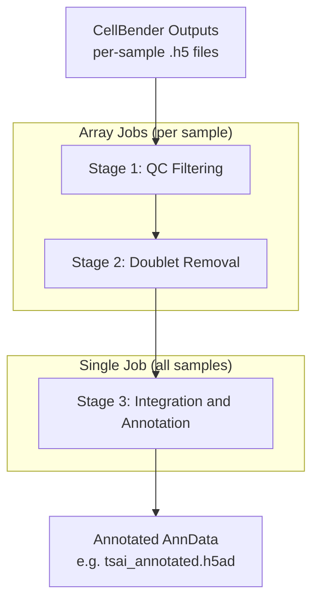

# Processing Overview

The processing phase takes ambient RNA-corrected count matrices from preprocessing and produces a single, integrated, cell type-annotated AnnData object. It consists of three stages, each performing a distinct task: quality control filtering, doublet removal, and integration with annotation.

!!! tip "Starting from CellBender output?"
    If you downloaded CellBender outputs via [Data Access](../data-access.md), you can start the processing pipeline directly. Ensure the data is in `Data/Transcriptomics/{dataset}/Cellbender_Output/` and your conda environments are set up.

Both datasets (DeJager and Tsai) use an identical three-stage pipeline with the same methods and parameters. The only differences are dataset-specific input paths and, for DeJager, an additional patient ID assignment step during Stage 1.

## Pipeline Architecture



Stages 1 and 2 run as SLURM array jobs, processing each sample independently in parallel. Stage 3 is a single job that loads all samples, concatenates them, and performs integration across the full dataset.

## Quick Start

Run the entire pipeline with automatic SLURM dependency chaining:

=== "Tsai"

    ```bash
    cd Processing/Tsai/Pipeline
    ./submit_pipeline.sh all
    ```

=== "DeJager"

    ```bash
    cd Processing/DeJager/Pipeline
    ./submit_pipeline.sh all
    ```

Submit individual stages or chains of stages:

```bash
./submit_pipeline.sh 1        # Stage 1 only
./submit_pipeline.sh 2 3      # Stages 2 and 3 (chained via SLURM dependency)
```

For testing on a small subset without SLURM:

=== "Tsai"

    ```bash
    python 01_qc_filter.py --sample-ids 10100574,10100862
    Rscript 02_doublet_removal.Rscript --sample-ids 10100574,10100862
    python 03_integration_annotation.py --sample-ids 10100574,10100862
    ```

=== "DeJager"

    ```bash
    python 01_qc_filter.py --sample-ids LIB5001_R1234567-alone
    Rscript 02_doublet_removal.Rscript --sample-ids LIB5001_R1234567-alone
    python 03_integration_annotation.py --sample-ids LIB5001_R1234567-alone
    ```

## Stage Summary

| Stage | Script | Environment | Input | Output | Job Type |
|-------|--------|-------------|-------|--------|----------|
| 1. QC Filtering | `01_qc_filter.py` | `QC_ENV` | CellBender `_filtered.h5` | `{sample}_qc.h5ad` + `qc_summary.csv` | Array |
| 2. Doublet Removal | `02_doublet_removal.Rscript` | `SINGLECELL_ENV` | `{sample}_qc.h5ad` | `{sample}_singlets.h5ad` + `doublet_summary.csv` | Array |
| 3. Integration | `03_integration_annotation.py` | `BATCHCORR_ENV` | All `*_singlets.h5ad` | `{dataset}_annotated.h5ad` | Single |

## Sample Discovery

The pipeline automatically discovers which samples to process:

- **Stage 1** scans the input directory for subdirectories containing `processed_feature_bc_matrix_filtered.h5`.
- **Stage 2** discovers `*_qc.h5ad` files from Stage 1 output.
- **Stage 3** discovers `*_singlets.h5ad` files from Stage 2 output.

Sample order is preserved from `patient_metadata.csv` to ensure reproducibility.

The SLURM array wrappers default to `--array=1-476%32` (Tsai) or `--array=1-200%32` (DeJager), with up to 32 concurrent tasks. Array tasks beyond the actual sample count exit gracefully. To override:

```bash
sbatch --array=1-$(python 01_qc_filter.py --list-samples | wc -l) 01_qc_filter.sh
```

## Output Directory Structure

=== "Tsai"

    ```
    Data/Transcriptomics/Tsai/Processing_Outputs/   # $TSAI_PROCESSING
    +-- 01_QC_Filtered/         # Per-sample QC-filtered h5ad files + qc_summary.csv
    +-- 02_Doublet_Removed/     # Per-sample singlet-only h5ad files + doublet_summary.csv
    +-- 03_Integrated/          # Integrated and annotated h5ad files + figures/
    +-- Logs/                   # SLURM stdout and stderr
    ```

=== "DeJager"

    ```
    Data/Transcriptomics/DeJager/Processing_Outputs/   # $DEJAGER_PROCESSING
    +-- 01_QC_Filtered/         # Per-library QC-filtered h5ad files + qc_summary.csv
    +-- 02_Doublet_Removed/     # Per-library singlet-only h5ad files + doublet_summary.csv
    +-- 03_Integrated/          # Integrated and annotated h5ad files + figures/
    +-- Logs/                   # SLURM stdout and stderr
    ```

Processing outputs can also be downloaded from the NAS instead of regenerated. See [Data Access](../data-access.md) for download instructions.

## SLURM Resource Requirements

| Stage | Cores | Memory | Time | Notes |
|-------|-------|--------|------|-------|
| 1. QC Filtering | 4 | 32 GB | 12 hours | Array job (Tsai: 476 tasks, DeJager: 200 tasks, 32 concurrent) |
| 2. Doublet Removal | 4 | 32 GB | 12 hours | Array job (same dimensions as Stage 1) |
| 3. Integration | 32 | 500 GB | 48 hours | Single job (loads all samples into memory) |

!!! warning "Stage 3 Memory"
    Stage 3 loads all samples into a single AnnData object for integration. For the Tsai dataset (476 samples), this requires approximately 500 GB of RAM. Ensure your SLURM partition can allocate this amount. The `lhtsai` partition on MIT Openmind is configured for this purpose.

## Configuration

All shell wrappers source `config/paths.sh` at the repository root. This is the single source of truth for conda environments, data directories, and SLURM log paths. To adapt the pipeline for a new cluster, edit `config/paths.sh` (or create `config/paths.local.sh`) and no changes to the pipeline scripts are needed.

Conda environment specs for recreating environments from scratch are in `Processing/Tsai/Pipeline/envs/`.

## Pages in This Section

| Page | Description |
|------|-------------|
| [QC Filtering](qc-filtering.md) | MAD-based quality control, percentile thresholds, cell count tracking |
| [Doublet Removal](doublet-removal.md) | scDblFinder tool, R environment bootstrapping, expected doublet rates |
| [Integration and Annotation](integration-annotation.md) | Normalization, HVG, PCA, Harmony, clustering, UMAP, ORA cell type annotation |
